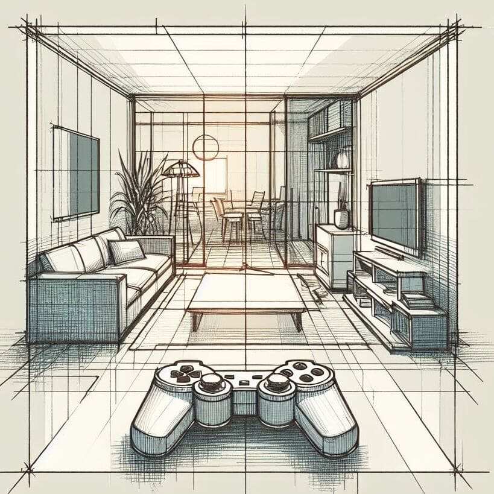

<p align="center">
	
	<h1 align="center">Godot Essentials</h1>


[](https://ko-fi.com/bananaholograma)
</p>

- [Getting started 📍](#getting-started-)
- [Important files 📋](#important-files-)
	- [default\_bus\_layout.tres](#default_bus_layouttres)
	- [.gitignore](#gitignore)
- [Organization of folders 📂](#organization-of-folders-)
	- [📁 Assets](#-assets)
	- [📁 Autoload](#-autoload)
	- [📁 Components](#-components)
	- [📁 Localization](#-localization)
	- [📁 Settings](#-settings)
	- [📁 Shaders](#-shaders)
- [Managers, our friends ⚖️](#managers-our-friends-️)
	- [Global Event Bus 🛜](#global-event-bus-)
		- [Example of use](#example-of-use)
	- [GameGlobals 🌐](#gameglobals-)
		- [Why Use GameGlobals?](#why-use-gameglobals)
		- [Example of use](#example-of-use-1)
	- [Achievements 🏆](#achievements-)
		- [Ready](#ready)
		- [File structure](#file-structure)
		- [Accessible variables](#accessible-variables)
		- [API Reference](#api-reference)
		- [Signals](#signals)
	- [GodotEnvironment variables 🛞](#godotenvironment-variables-)
		- [Variable tracker](#variable-tracker)
			- [Example of use](#example-of-use-2)
		- [Loading variables from other files](#loading-variables-from-other-files)
		- [Signals](#signals-1)
		- [API reference](#api-reference-1)
	- [AudioManager 🔊](#audiomanager-)
		- [Accessible variables](#accessible-variables-1)
		- [API reference](#api-reference-2)
	- [MusicManager 📻](#musicmanager-)
		- [Ready](#ready-1)
		- [Accessible variables](#accessible-variables-2)
		- [API Reference](#api-reference-3)
		- [Signals](#signals-2)
	- [Global Camera Transition 🎥](#global-camera-transition-)
		- [How to Use](#how-to-use)
		- [Transition steps](#transition-steps)
		- [Accessible variables](#accessible-variables-3)
		- [API reference](#api-reference-4)
		- [Signals](#signals-3)
	- [Utility Helpers (Wizards) 🪄](#utility-helpers-wizards-)
		- [Camera3DWizard 📹](#camera3dwizard-)
		- [InputWizard 🎮](#inputwizard-)
		- [StringWizard 🔤](#stringwizard-)
		- [VectorWizard ➖](#vectorwizard-)
		- [NodeWizard ⭕](#nodewizard-)
	- [GameControllerManager 🎮](#gamecontrollermanager-)
		- [Accessible variables](#accessible-variables-4)
		- [Signals](#signals-4)
	- [SaveManager 💾](#savemanager-)
		- [How the manager works](#how-the-manager-works)
		- [SavedGame resource](#savedgame-resource)
	- [SceneTransitionManager 🎬](#scenetransitionmanager-)
		- [Features](#features)
		- [Benefits](#benefits)
		- [How to use](#how-to-use-1)
		- [How to transition to a scene](#how-to-transition-to-a-scene)
		- [How to add new transitions](#how-to-add-new-transitions)
	- [FileManager 🗃️](#filemanager-️)
		- [API Reference](#api-reference-5)
		- [How to use](#how-to-use-2)
- [Utilities 🧰](#utilities-)
- [UUID 🔑](#uuid-)
- [Bitstream 💠](#bitstream-)
- [Components 🧩](#components-)
	- [Audio 🔊](#audio-)
		- [ConsumableAudioStreamPlayer 🔉](#consumableaudiostreamplayer-)
		- [SoundQueue 🔉](#soundqueue-)
		- [FootstepManager3D 👣](#footstepmanager3d-)
	- [Behaviour 🤖](#behaviour-)
		- [HealthComponent 💚](#healthcomponent-)
		- [Finite State Machine 🔁](#finite-state-machine-)
	- [Camera 🎥](#camera-)
		- [ShakeCamera2D 🌋](#shakecamera2d-)
		- [ShakeCamera3D 🌋](#shakecamera3d-)
		- [Free look camera 👁️](#free-look-camera-️)
	- [Collisions 💥](#collisions-)
		- [Hurtbox \& Hitbox ⏺️](#hurtbox--hitbox-️)
	- [Debug 🪲](#debug-)
		- [Control visualizer 🕶️](#control-visualizer-️)
		- [Pixel viewport drawing 🔲](#pixel-viewport-drawing-)
	- [Input ⌨️](#input-️)
		- [TransformedInputDirection ↔️](#transformedinputdirection-️)
	- [Lights 💡](#lights-)
		- [RandomLight2D/3D 🚨](#randomlight2d3d-)
	- [Interaction 🔎](#interaction-)
		- [Interactable \& Interactor ⭕](#interactable--interactor-)
		- [Destructible 🪨](#destructible-)
		- [Door 🚪](#door-)
		- [SwitchableLight3D 💡](#switchablelight3d-)
		- [Throwable3D 🎳](#throwable3d-)
		- [Telekinesis 👋](#telekinesis-)
		- [Circular Inventory 3D ⚫](#circular-inventory-3d-)
	- [Movement 👟](#movement-)
		- [FirstPersonController 🏃](#firstpersoncontroller-)
		- [Dungeon Grid Movement 3D 💀](#dungeon-grid-movement-3d-)
		- [Mouse Rotator Component 3D 🖱️](#mouse-rotator-component-3d-️)
		- [Room Rotator Component 3D 🏠](#room-rotator-component-3d-)
	- [Narration 📖](#narration-)
		- [TypedText ⌨️](#typedtext-️)


# Getting started 📍
This repository is a double threat: it's both **a template** to get you started and a **learning tool** to help you grow as a game developer.  We've kept it minimalist, focusing on functional code that you can easily build upon or modify, without any pre-made menus or clutter.

Most of the components are neatly separated into 2D or 3D folders, making them easy to find and use. if you only need one component or autoload you can copy the code and use it in your project directly, it is not necessary to download it as a plugin or this entire repository.

- - -
**Default Autoloads:**

The following autoloads are automatically loaded when this project starts:

- `Utilities`
- `GlobalEventBus`
- `GameGlobals`

**Other Autoloads:**

*For information about other scripts or scenes that can be added as autoloads, please refer to their individual documentation. This documentation will specify whether the script/scene is intended to be used as an autoload and its overall functionality.*

- - -

**⚠️ This document is a compilation of knowledge I've gathered during my first year of learning. While it may not be comprehensive or officially supported, it's intended to be a helpful resource for others starting their own learning journey⚠️**

f you have any questions, you can reach me on the official [Godot Discord server](https://discord.godot.community/) under the username ***@BananaHolograma***

Feeling generous? Buy me a coffee on Ko-fi!  [](https://ko-fi.com/bananaholograma)


# Important files 📋
## default_bus_layout.tres
This file acts as a master list for your game's audio channels. By default, it defines channels for music, sound effects, ambient sounds, UI sounds, and voice acting. if you have added more audio categories *(buses)* to your game, don't forget update the `GameSettings.gd` resource to reflect the changes.

## .gitignore
This file helps keep your project tidy by ignoring unnecessary files that shouldn't be tracked by version control. It includes commonly ignored files for various platforms.

# Organization of folders 📂
## 📁 Assets
This folder houses your project's visual assets, like sprites, images, and models. By default, it only contains the two crosshair images used by the `InteractionPointer` component to keep things streamlined and avoid clutter.

## 📁 Autoload
Think of this folder as your central hub for reusable managers and static classes. These handy tools can be accessed from anywhere in your project. Managers often act as singletons *(meaning only one instance exists)*, while static classes don't require inheritance from a Godot object.

## 📁 Components
Ever need to add some extra oomph to your nodes? Look no further than the Components folder! Here you'll find reusable, modular components that boost your nodes' functionality. If a component works differently in 2D and 3D, it'll have its own dedicated folder within Components to keep things organized.

## 📁 Localization
We've included a small `Localization.csv` file as a starting point for translating your game into different languages. It contains some standard entries to get you going. Simply replace the provided text with your own translations!

## 📁 Settings
This folder stores your game's fundamental settings, like resources related to basic gameplay options. This one is also included in the `SaveGame` resource, which gets packaged with your saved games for seamless continuity.

## 📁 Shaders
We've got you covered with a handy collection of basic shaders - these are visual effects you can apply to your game elements. You'll probably find yourself using them quite often! 

***The VHS shader even comes with some cool images to create a retro camera feel and draw players deeper into your game world.***

# Managers, our friends ⚖️
What video game doesn't have one? They are useful for sharing data between scenes, changing scenes, loading screens, managing audio *(e.g. keep the music playing when changing scenes)*, create global variables and a lot more.

If you're new using autoloads in Godot check it out the [official documentation](https://docs.godotengine.org/en/stable/tutorials/scripting/singletons_autoload.html) for further information.

## Global Event Bus 🛜
The Global Event Bus provides a central communication hub for your project. It allows any script to broadcast signals (messages) that other scripts can listen for and react to. This is particularly useful for coordinating events across diverse parts of your game logic.

Think of it like a loudspeaker system. Scripts can "speak" by emitting signals, and other scripts can "listen" by connecting to those signals. This enables scripts to communicate and trigger actions even if they don't have a direct reference to each other.

This template comes pre-populated with some global signals that it uses. However, you can also create custom signals to handle specific communication needs within your game.

### Example of use
```bash
GlobalEventBus.lock_player.emit()
# or
GlobalEventBus.emit_signal("lock_player")


## my_script.gd
extends CharacterBody2D

func _ready():
	GlobalEventBus.lock_player.connect(on_locked_player_requested)

func on_locked_player_requested():
	## Do stuff..
```

## GameGlobals 🌐
While the **Global Event Bus** focuses on sending messages, the **GameGlobals** serves a different purpose: persistent storage. This autoload script acts as a central repository for data that needs to be accessible from anywhere in your game.

Think of it like a global storage cabinet. Here you can store essential information that needs to be shared across your entire game, similar to how variables within a class are accessible by all its methods. This data could include:

- **Saved values:** Game settings, player progress, or high scores.
- **Class references:** Shared utility classes.
- **Resource references:** Global resources like fonts, materials, or sound effects.
- **Node references:** Specific nodes that need to be accessed from various parts of your game *(use with caution to avoid tight coupling).*

### Why Use GameGlobals?
- **Centralized access:** Scripts throughout your project can easily retrieve and modify critical data.
- **Persistence:** The data is saved and loaded between game sessions, ensuring continuity.
Important Note:

This autoload script is currently empty because the specific data you need to store globally depends on your unique game requirements. Consider carefully what information truly needs to be shared globally to avoid unnecessary complexity.

### Example of use
```bash
## GameGlobals autoload
extends Node 

var highscore := 0

## some_script.gd
func increase_score(amount: int):
	score += amount
	GameGlobals.highscore = score

## other ui node
func display_highscore():
	 label.text = GameGlobals.highscore

```

## Achievements 🏆
Implement achievements in your game in a simple way and with minimal security practices. This autoload is intended to use a local or remote file to store achievements.

You can access this functionality using the class `Achievements` where you can interact with your source file. *It's important to note that you need to autoload the `achievements.tscn` because this class needs the [HttpRequest](https://docs.godotengine.org/en/stable/classes/class_httprequest.html) node to do remote calls.*

**Before start you need to set few project settings that will be available as a exported variable:**

**Local source** refers to the path of the local file that contains the achievements template. This file is read-only and is used solely to define the structure of the achievements in your game. For example: res://settings/achievements.json.

**Remote source**, on the other hand, refers to the path of the remote JSON file that also holds the achievements template. The same rules apply as for the local source, but this information is obtained from a remote URL. For example https://myserver/achievements.json

**Save directory** is the location where the encrypted saved file, used to track achievement progress, will be created on the player's machine. By default, it utilizes `OS.get_user_data_dir()/[project_name].`

**Save file** name is the name of the encrypted file that tracks achievement progress. By default, it is named `achievements` and the file format will be automatically added as `.json`

**Password** is the character set used for encrypting and decrypting the saved achievements file. By default, it generates a random string with a length of 25 characters. This length should be sufficient for most use cases, ensuring that players cannot alter their achievement progress accessing the file.

### Ready
When this node becomes ready, it performs several actions:

- It connects itself to the achievement_updated signal, which updates the encrypted file and checks if all achievements have been unlocked. If all achievements are unlocked, it emits the `all_achievements_unlocked` signal.

- It creates the save directory using `OS.get_user_data_dir() + "/achievements"`

- It prepares the achievements within the class by reading from the sources defined. *This class never alters the source files, only the file that is saved in the user's folder.*

- Sync the latest achievements update from the encrypted saved file if it exists and update this one.

### File structure
The JSON file must adhere to a specific structure in order to function correctly. While you can include additional custom properties tailored to your game, there are mandatory ones that must be present:
```json
{
	"achievement-name": {
		"id": "my-achievement",
		"name": "MY achievement",
		"description": "Kill 25 enemies",
		"is_secret": false,
		"count_goal": 25,
		"current_progress": 0.0,
		"icon_path": "res://assets/icon/my-achievement.png",
		"unlocked": false,
		"active": true
	}
}
```

Also supports array syntax but the achievements **needs to have an 'id'** property to use as key on the transformation
```json
[
	{
		"id": "my-achievement",
		"name": "MY achievement",
		"description": "Kill 25 enemies",
		"is_secret": false,
		"count_goal": 25,
		"current_progress": 0.0,
		"icon_path": "res://assets/icon/my-achievement.png",
		"unlocked": false,
		"active": true
	}
]

```
***When you set the source as remote you can await for the signal `remote_achievements_loaded` to confirm that the achievements have been uploaded and continue your flow***

It's important to note that not all achievements will have a `count_goal` requirement for unlocking progress. In cases where this requirement is not applicable, you should leave the `count_goal` value as zero. The logic and conditions for unlocking achievements are entirely determined by your game project. 

This class serves as a helper for updating and unlocking achievements while emitting the appropriate signals for interaction.

### Accessible variables
- current_achievements: Dictionary = {}
- unlocked_achievements: Dictionary = {}
- achievements_keys: PackedStringArray = []

### API Reference
`get_achievement(name: String) -> Dictionary`
Retrieve the information from the desired achievement, if the name does not exist as key it will return an empty dictionary.

```python
Achievements.get_achievement("orcs_party")
```


`update_achievement(name: String, data: Dictionary)`
This function updates the properties of the selected achievement, with values from the data dictionary overriding the existing ones. This action also emits the `achievement_updated signal.`

```python
Achievements.update_achievement("orcs_party", {"current_progress": 0.55})
```

`unlock_achievement(name: String)`
If the achievement was not previously unlocked, this function changes the unlocked variable to true and emits the `achievement_unlocked` signal. This action directly unlocks the achievement without further checks.

```python
Achievements.unlock_achievement("orcs_party")
```

`reset_achievement(name: String, data: Dictionary = {})`
Reset the achievement to a previous state. The `current_progress` and unlocked will be set to 0 and false respectively. You can pass as second parameter the data you want to update in this process.

This action also emits the `achievement_reset` & `achievement_updated` signals

```python
Achievements.reset_achievement("orcs_party", {"description": "An orc party was discovered"})
```

### Signals
```bash
signal achievement_unlocked(_name: String, achievement: Dictionary)
signal achievement_updated(_name: String, achievement: Dictionary) 
signal achievement_reset(_name: String, achievement: Dictionary)
signal all_achievements_unlocked
signal remote_achievements_loaded
```
 

## GodotEnvironment variables 🛞
You can access all features by using the `GodotEnvironment` class in any part of your code. This class provides extra functionality while maintaining compatibility with `OS.get_environment()` and `OS.set_environment()` for runtime variable management.

By default, this class looks for `.env` files in the root of your project `res://` To modify this path, you can use:

```bash
GodotEnvironment.ENVIRONMENT_FILES_PATH = "res://project"
```

### Variable tracker
For internal execution convenience, the plugin tracks active variables without storing their values in array, as storing sensitive content in this array can risk data leaks or unauthorized access. This approach allows you to verify which variables have been read and loaded into memory without exposing their values.

```
GodotEnvironment.ENVIRONMENT_VARIABLE_TRACKER
# ["ADDRESS", "PORT", "SERVER_ID]
```

#### Example of use
```bash
# .env file
ADDRESS=127.0.0.1
PORT=9492

SERVER_ID=1919

# random_script.gd
GodotEnvironment.load_env_file(".env")

GodotEnvironment.get_var("PORT") # Returns an empty string if does not exists
# or
GodotEnvironment.get_var_or_null("PORT") # Returns null instead
```
**You only need to load your environment variables once**, and there's no need to load them in every `_ready()` function in your nodes. If you have duplicate variables, the value used will be the one from the last occurrence. Therefore, it's important to review your files carefully to avoid unintentional overwriting.
```bash
ADDRESS=127.0.0.1
ADDRESS=192.168.1.55 # This is the one that will be assigned as it overwrites the previous one
```
### Loading variables from other files
This class supports reading multiple environment files. For production, it's highly advisable to refrain from including the `.env` file in your source code repository. Instead, consider providing on the repository an `.env.example` file with blank values for the keys used. This strategy enables you to duplicate the file and input the values in your local environment, thereby averting the inadvertent exposure of sensitive information.

```bash
# .env.example
ADDRESS=
PORT=
SERVER_NAME=

# your_script.gd
GodotEnvironment.load_env_file(".env.example")
GodotEnvironment.load_env_file(".env.dev")
GodotEnvironment.load_env_file(".env.staging")
# ...
```
### Signals
```bash
signal variable_added(key: String)
signal variable_removed(key: String)
signal variable_replaced(key: String)
signal env_file_loaded(filename: String)
```

### API reference
`get_var(key: String) -> String`
This is an alternative to `OS.get_environment(key)`

```bash
GodotEnvironment.get_var("SERVER_PORT")
```

`get_var_or_null(key: String)`
Retrieve the value of an environment variable by its key or null it if it doesn't.

```bash
GodotEnvironment.get_var_or_null("SERVER_PORT")
```

`set_var(key: String, value: String = "") -> void`
Set a environment variable on the runtime process, this is an alternative to `OS.set_environment(key, value)`

```bash
GodotEnvironment.set_var("API_KEY", "991918291921")
```
`remove_var(key: String)-> void`
Remove a variable from the runtime process

```bash
GodotEnvironment.remove_var("API_KEY")
```
`create_environment_file(filename: String = ".env", overwrite: bool = false) -> void`
Create an environment file with the specified filename. If it already exists, it can be overwritten

```bash
GodotEnvironment.create_environment_file(".env")
GodotEnvironment.add_var_to_file("env", "PORT", 3000)
GodotEnvironment.add_var_to_file("env", "ENCRYPTION_ALGORITHM", 'SHA256')
```

`load_env_file(filename: String = ".env") -> void`
Read an .env file and set the environment variables to be accessible in the code


```bash
GodotEnvironment.load_env_file(".env.example")
```

`flush_environment_variables(filename: String = ".env", except: Array[String] = []) -> void`
Remove environment variables from the current process runtime. You can add the keys that you do not want to be deleted in this process.

```bash
GodotEnvironment.flush_environment_variables(".env")
GodotEnvironment.flush_environment_variables(".env", ["IP_ADDRESS", "COUNTRY"])
```

`add_var_to_file(filename: String, key: String, value: String = "") -> void`
Add a key-value pair to an environment file and set the environment variable

```bash
GodotEnvironment.add_var_to_file("env", "PORT", 4500)
GodotEnvironment.add_var_to_file("env", "APP_NAME", 'FightingTournament')
```

## AudioManager 🔊
This class is intended for very simple operations on the buses that exist in your project. Change the volume, detect if a stream is loopable, is muted...


### Accessible variables
You can access all your buses names without modifications in array format with:
 ```bash
 AudioManager.available_buses # ["Music", "SFX", "Ambient", "UI", "Voice"]
 ```

 ### API reference
 `change_volume(bus, volume_value: float) -> void`
 This function allows you to adjust the volume of a specific audio bus. You can provide the bus identifier as either a string name or an integer index. The function automatically handles linear-to-decibel and vice-versa conversions for the volume value.

`get_actual_volume_db_from_bus_name(bus_name: String) -> float:`

`get_actual_volume_db_from_bus_index(bus_index: int) -> float:`

Use these functions to retrieve the current volume *(in decibels)* of a bus. You can choose to specify the bus by either its name *(string) or its index (integer).

`is_stream_looped(stream: AudioStream) -> bool`
This function checks if the provided audio stream loops when played. It automatically detects the stream type *(e.g., AudioStreamMp3, AudioStreamOggVorbis)* and performs the appropriate checks for looping behavior.

`is_muted(bus = MASTER_BUS_INDEX) -> bool`
This function lets you check whether a specific audio bus is muted. You can specify the bus by either its name or index. If no argument is provided, it defaults to checking the master bus *(index 0)*.

`mute_bus(bus, mute_flag: bool = true) -> void:`
Use this function to mute or unmute an audio bus. Provide the bus identifier (string or integer) and an optional boolean flag. A True flag mutes the bus, while False unmutes it.

**Example to use on sliders for an option menu:**
Remember to set the volume sliders with **max value of 1** and **step of 0.001** to apply the volume changes properly.

```bash
func _on_music_slider_value_changed(value):
	AudioManager.change_volume("Music", value)

func _on_sound_effects_slider_value_changed(value):
	AudioManager.change_volume("SFX", value)

func _on_master_slider_value_changed(value):
	AudioManager.change_volume("Master", value)
```

## MusicManager 📻
The MusicManager focuses specifically on managing background music in your game. Unlike the general AudioManager, it offers features like crossfading and track dwelling between scenes for a smoother music experience.

***This autoload node needs the `AudioManager` also be loaded as an autoload since it is used internally.***

**Adding to the Music Bank:**

Before playing music, you need to add the audio stream to the music bank using `add_stream_to_music_bank(stream_name: String, stream: AudioStream)`. This function allows you to reference the music track by its `stream_name` later.
You can populate the music bank from various sources, including preloaded tracks stored in a dictionary or constants defined in your music script.

**Removing Tracks:**
If you need to remove a music track from the bank, use `remove_stream_from_music_bank(stream_name: String)`. This function gracefully handles cases where the specified `stream_name` doesn't exist.

### Ready
When this autoload get's ready two `AudioStreamPlayers` are created to allow crossfade between track changes.

### Accessible variables
```bash
## Dictionary<string, AudioStream>
var music_bank := {}
var main_audio_stream_player: AudioStreamPlayer
var secondary_audio_stream_player: AudioStreamPlayer

var current_audio_stream_player: AudioStreamPlayer
var crossfade_time := 2.0
```
### API Reference
`play_music(stream_name: String, crossfade: bool = true, crossfading_time: float = crossfade_time)`
To play a music track it's simple as pass the `stream_name` into this function, optionally you can choose do a smooth transition using crossfade if already a music track is being played. The `crossfade_time` by default it's `2.0`

`add_stream_to_music_bank(stream_name: String, stream: AudioStream)`
Add the stream to the music bank making it available for the MusicManager

`remove_stream_from_music_bank(stream_name: String)`
Remove the stream from the music bank, if the stream_name does not exist in the music bank no errors are triggered.

### Signals
```bash
signal added_music_to_bank(_name: String, stream: AudioStream)
signal removed_music_from_bank(_name: String)
signal changed_stream(from: AudioStream, to: AudioStream)
```

## Global Camera Transition 🎥
This system allows you to smoothly transition between cameras in your game using the `GlobalCameraTransition` class. To enable this functionality, you'll need to autoload the `global_camera_transition.tscn`. This scene creates two cameras internally for transition purposes.

**Concept:**
The system utilizes a third, global camera to facilitate the transition between two other cameras. This temporary camera mimics the properties of the camera you want to transition to. Once the transition completes, the target camera becomes the active camera in your scene.

**Benefits**:
Record Transitions: Easily record transition sequences between cameras for smooth playback.
Manage Duration: Control the duration of the transition for a polished effect.

### How to Use
This class supports transitions for both 2D and 3D cameras. You can trigger a basic transition in two ways:

**Via method call**
 - **2D:** `transition_to_requested_camera_2d(from, to, duration)`
 - **3D:** `transition_to_requested_camera_3d(from, to, duration)`

- Replace `from `with the origin camera node.
- Replace `to` with the target camera node you want to transition to.
- Set the `duration` *(in seconds)* to control how long the transition takes.

**Via global event bus**
```bash
GlobalEventBus.transition_camera_2d_requested.emit(from, to, duration)
GlobalEventBus.transition_camera_3d_requested.emit(from, to, duration)
```

***Important note:***
If a camera transition is already in progress, attempting to trigger another transition of the same type *(2D or 3D)* will not interrupt the ongoing one. Wait for the current transition to finish before initiating a new one.

This system can handle simultaneous transitions between cameras, but with a limitation: only one transition can be active at a time for each camera type *(2D or 3D).*

In simpler terms, you can't have multiple transitions happening for the same type of camera *(2D or 3D)* at once. However, you can:

Transition between two 3D cameras while also transitioning between two separate 2D cameras in a subviewport.
This allows you to have independent transitions occurring in your 2D and 3D environments simultaneously.

### Transition steps
When a transition is recorded it will create a class `TransitionStep2D` or `TransitionStep3D` depending on the transition requested.

Here is the structure:
```bash
class TransitionStep2D:
	var from: Camera2D
	var to: Camera2D
	var duration: float
	
	func _init(_from: Camera2D, _to: Camera2D, _duration: float):
		from = _from
		to = _to
		duration = absf(_duration)


class TransitionStep3D:
	var from: Camera3D
	var to: Camera3D
	var duration: float
	
	func _init(_from: Camera3D, _to: Camera3D, _duration: float):
		from = _from
		to = _to
		duration = absf(_duration)
```

You can access the current recorded transitions with the existing variables:
```bash
var transition_steps_2d: Array[TransitionStep2D] = []
var transition_steps_3d: Array[TransitionStep3D] = []

## anywhere...
GlobalCameraTransition.transition_steps_2d
GlobalCameraTransition.transition_steps_3d
```

### Accessible variables
You can set some default values on this variables:
```bash
@export var transition_duration := 1.5 ## Default transition duration for all transitions requested
@export var remove_last_transition_step_2d_on_back := false
@export var remove_last_transition_step_3d_on_back := false

```

### API reference
`transition_to_requested_camera_2d(from: Camera2D, to: Camera2D, duration: float = transition_duration, record_transition: bool = true):`

- Transitions from the from (current) 2D camera to the to (target) 2D camera.
- Optionally specify the duration (in seconds) to control the transition speed. Defaults to a pre-defined transition_duration.
- Set record_transition to true (default) to record this step for later playback using "next" or "all steps" methods.

`transition_to_requested_camera_3d(from: Camera3D, to: Camera3D, duration: float = transition_duration, record_transition: bool = true):`

Similar to the 2D version, but transitions between 3D cameras.

`transition_to_next_camera_2d(to: Camera2D, duration: float = transition_duration):`
Transition to the provided camera from the last step recorded on `transition_steps_2d`. If there are no recorded steps, no transition occurs.

`transition_to_next_camera_3d(to: Camera3D, duration: float = transition_duration):`
Similar to the 2D version, but applies to 3D camera transitions.

`transition_to_previous_camera_2d(delete_step: bool = remove_last_transition_step_2d_on_back):`
Transition to a previous camera from the last one in `transition_step_2d`. If `delete_step` is true, this last recorded transition will be deleted from the variable `transition_step_2d`

`transition_to_previous_camera_3d(delete_step: bool = remove_last_transition_step_3d_on_back):`
Similar to the 2D version, but applies to 3D camera transitions.

`transition_to_first_camera_via_all_steps_2d(clean_steps_on_finished: bool = false):`
Transition to the first camera recorded on `transition_step_2d`. If `clean_steps_on_finished` is true, the recorded transitions will be deleted after the operation ends.

`transition_to_first_camera_via_all_steps_3d(clean_steps_on_finished: bool = false):`
Similar to the 2D version, but applies to 3D camera transitions.

### Signals
```bash
signal transition_2d_started(from: Camera2D, to: Camera2D, duration: float)
signal transition_2d_finished(from: Camera2D, to: Camera2D, duration: float)
signal transition_3d_started(from: Camera3D, to: Camera3D, duration: float)
signal transition_3d_finished(from: Camera3D, to: Camera3D, duration: float)
```

## Utility Helpers (Wizards) 🪄
This section introduces a collection of helpful utility functions called "Wizards." Unlike most Godot classes, these wizards are static *(don't require instances)* and don't need to be autoloaded. You can access them from anywhere in your project to perform specific tasks without depending on a particular game context or flow.

Think of them as magic tools in your coding toolbox!

### Camera3DWizard 📹
This specific wizard focuses on helping you with 3D camera manipulation:

`center_by_ray_origin(camera: Camera3D) -> Vector3:`
Returns the origin point of the camera's view as a Vector3 using a raycast projection.

`center_by_origin(camera: Camera3D) -> Vector3:`
Simpler version of `center_by_ray_origin.` It retrieves the camera's origin directly, without using rays.

`forward_direction(camera: Camera3D) -> Vector3:`
Provides the current direction the camera is facing as a Vector3. This is useful for various purposes, like applying forces in the camera's direction or creating dynamic raycasts.
**Example of use:**
```bash
func throw_body(body: Throwable3D, throw_power: float):
	var impulse := Camera3DWizard.forward_direction(get_viewport().get_camera_3d()) * throw_power
	## //...
```

### InputWizard 🎮
This section introduces the `InputWizard`, a collection of helpful functions for handling common input-related tasks in your game. It acts as a shortcut to avoid repetitive code for frequently used input checks.

`is_mouse_left_click(event: InputEvent) -> bool`
Quickly checks if the left mouse button was clicked in the given InputEvent.


`is_mouse_right_click(event: InputEvent) -> bool`
Similar to is_mouse_left_click, but checks for the right mouse button click.

`numeric_key_pressed(event: InputEvent) -> bool:`
Determines if a numeric key *(including numpad keys)* was pressed in the InputEvent.

`readable_key(key: InputEventKey):`
Translates a raw InputEventKey into a human-readable string representation. This is useful for displaying what key was pressed, including modifiers like "ctrl" or "shift" and physical key names.

```bash
## Basic example
func _input(event: InputEvent):
	if event is InputEventKey:
	   InputWizard.readable_key(event)
		# Display the pressed key combination (e.g., "ctrl + alt + shift")
   	   print("Pressed key:", readable_key_text)
```

`is_any_action_just_pressed(_event:InputEvent, actions: Array = []):`
This powerful function checks if any of the actions listed in the provided actions array were just pressed in the InputEvent. This can simplify handling multiple key or button presses simultaneously.

`action_just_pressed_and_exists(action: String) -> bool:`
This function checks if the action exists in the `InputMap` and is just pressed. The static class `Input` is used directly so this function only needs the input action name.

`action_pressed_and_exists(event: InputEvent, action: String) -> bool:`
This function checks if the action exists in the `InputMap` and is pressed. This one needs the event as it's being used the `event.is_action_pressed` with the difference that in the previous one the static class `Input` is used directly

`is_any_action_pressed(_event:InputEvent, actions: Array = []):`
Similar to `is_any_action_just_pressed`, but checks if any of the actions in the array are currently being held down (pressed).

`is_any_action_just_released(_event:InputEvent, actions: Array = []):`
This function checks if any of the actions in the actions array were just released in the InputEvent. This can be useful for detecting when a player lets go of a key or button.

### StringWizard 🔤
This section provides helpful functions for manipulating strings:

`generate_random_string(length: int = 25, characters: String = "abcdefghijklmnopqrstuvwxyzABCDEFGHIJKLMNOPQRSTUVWXYZ0123456789") -> String`
Generates a random string of a specified length using the provided character set. Defaults to a length of 25 and includes lowercase, uppercase letters, and numbers.
**To ensure a valid string, it requires a length greater than 1 and at least one valid character. Otherwise, it returns null.**

`camel_to_snake(camel_string: String) -> String:`
Converts PascalCaseString into snake_case_string

`snake_to_camel_case(screaming_snake_case: String) -> String:`
Converts snake_case_string or SCREAMING_SNAKE_CASE into PascalCaseString

### VectorWizard ➖
The `VectorWizard` static class provides a collection of commonly used vector methods that can simplify your everyday game development tasks. While it offers a wide range of functions, in-depth documentation might not be available for every method. However, the method names themselves are designed to be clear and descriptive.

`up_direction_opposite_vector2(up_direction: Vector2) -> Vector2`
This method calculates the opposite of a given upward direction vector in 2D space. For example, if your `CharacterBody2D` uses `Vector2.UP` as its up direction, the opposite would be `Vector2.DOWN`. This function is useful for applying gravity in the opposite direction of the player, allowing you to create inverted gravity or flipped worlds. Even when your player changes their up direction to `Vector2.DOWN`, this method will correctly return `Vector2.UP` so you can set gravity pulls player in that direction.

`up_direction_opposite_vector3(up_direction: Vector3) -> Vector3:`
This method functions similarly to the `up_direction_opposite_vector2` but for 3D space. It takes a 3D up direction vector and returns its opposite. This is helpful for manipulating gravity and character movement in a 3D environment.

`generate_2d_random_directions_using_degrees(num_directions: int = 10, origin: Vector2 = Vector2.UP, min_angle: float = 0.0, max_angle: float = 360.0) -> Array[Vector2`
Generate a number of random directions defining the min and max angle ranges in degrees from an origin Vector. 

```bash
VectorWizard.generate_2d_random_directions_using_degrees(25, Vector2.UP, 0.0, 180.0)
## Gives:
[(-0.154511, 0.987991), (-0.992617, 0.121292), (0.057514, -0.998345), (0.974746, 0.223318), (0.263847, -0.964564), (0.919611, -0.39283), (0.977242, -0.212127), (0.77084, 0.637029), (0.710658, -0.703537), (0.502805, -0.8644), (0.847936, -0.530098), (0.529105, 0.848556), (-0.590306, 0.807179), (-0.39893, -0.916982), (0.548017, -0.836467), (-0.985881, 0.16745), (-0.742192, 0.670187), (0.500704, -0.865619), (-0.475163, 0.879898), (-0.997218, 0.074546), (0.134006, 0.990981), (0.902739, 0.430189), (-0.477565, 0.878597), (0.024833, -0.999692), (0.832958, 0.553336)]
```

`generate_3d_random_directions_using_degrees(num_directions: int = 10, origin: Vector3 = Vector3.UP, min_angle: float = 0.0, max_angle: float = 360.0) -> Array[Vector3]`
Same as above but with Vector3

`generate_2d_random_directions_using_radians(num_directions: int = 10, origin: Vector2 = Vector2.UP, min_angle: float = 0.0, max_angle: float = 6.2831853072) -> Array[Vector2]`
Generate a number of random directions defining the min and max angle ranges in radians from an origin Vector. 

`generate_3d_random_directions_using_radians(num_directions: int = 10, origin: Vector3 = Vector3.UP, min_angle: float = 0.0, max_angle: float = 6.2831853072) -> Array[Vector3]`
Same as above but with Vector3

- `generate_random_angle_in_radians(min_angle: float = 0.0, max_angle: float = 6.2831853072) -> float`
- `generate_random_angle_in_degrees(min_angle: float = 0.0, max_angle: float = 360.0) -> float`

Generates a random angle in radians within the specified range (defaults to 0 to 2π) or (defaults to 0 to 360 degrees)

`generate_2d_random_direction() -> Vector2:`
Generates a random 2D direction vector with floating-point values representing a unit vector in space *(magnitude of 1)*.
This function is useful for creating diverse movement directions or raycasts.

`generate_2d_random_fixed_direction() -> Vector2:`
Generates a random 2D direction vector with integer values representing cardinal directions *(e.g., Vector2(1, 0), Vector2(0, -1))* or other fixed directional combinations.
This function can be used for grid-based movement or discrete directional checks.

`generate_3d_random_direction() -> Vector3:`
Generates a random 3D direction vector with floating-point values representing a unit vector in space.
This function is useful for creating random 3D movement directions or raycasts.

`generate_3d_random_fixed_direction() -> Vector3:`
Generates a random 3D direction vector with integer values representing axes or other fixed directional combinations in 3D space *(e.g., Vector3(1, 0, 0), Vector3(0, 1, -1)).*
This function can be used for checks or movement along specific axes or predefined directions.

`generate_random_mesh_surface_position(target: MeshInstance3D) -> Vector3`
Generate a random point in the mesh surface passed as parameter. Useful to get random points from a specific surface, the destructibles use this function to access random positions on the mesh surface to create a more realistic approach.

`translate_x_axis_to_vector(axis: float) -> Vector2:`
Converts a value from the horizontal axis of user input *(typically obtained using `Input.get_axis("move_left", "move_right")`)* to a corresponding 2D direction vector. This function simplifies translating user input for horizontal movement into a usable direction vector.
```bash
	func _input(event: InputEvent):
		var axis = Input.get_axis("move_left", "move_right") # -1.0
		var direction = VectorWizard.translate_x_axis_to_vector(axis) # Return Vector2.Left 
		
```

`translate_y_axis_to_vector(axis: float) -> Vector2:`
Converts a value from the vertical axis of user input *(typically obtained using `Input.get_axis("move_up", "move_down")`)* to a corresponding 2D direction vector. This function simplifies translating user input for horizontal movement into a usable direction vector.

```bash
	func _input(event: InputEvent):
		var axis = Input.get_axis("move_up", "move_down") # 1.0
		var direction = VectorWizard.translate_y_axis_to_vector(axis) # Return Vector2.DOWN 	
```
- - -

- `normalize_vector2(value: Vector2) -> Vector2`
- `normalize_vector3(value: Vector3) -> Vector3:`

These functions normalize a given 2D or 3D vector while accounting for diagonal directions. While Godot provides a built-in `.normalized()` function for vector normalization, these functions potentially offer a more nuanced approach.

The standard `.normalized()` function in Godot scales the vector to a magnitude (length) of 1. However, for diagonal vectors, it might not perfectly represent the intended unit vector along the diagonal.

Only uses this if you need to take into account diagonal directions.

- - -

- `distance_manhattan_v2(a: Vector2, b: Vector2) -> float:`
- `distance_manhattan_v3(a: Vector3, b: Vector3) -> float:`
- `length_manhattan_v2(a : Vector2) -> float`
- `length_manhattan_v3(a : Vector3) -> float`

Also known as the "city distance" or "L1 distance". It measures the distance between two points as the sum of the absolute differences of their coordinates in each dimension.

- **Explanation:** These functions calculate the Manhattan distance *(also known as L1 distance or city block distance)* between two points. It represents the total distance traveled by moving horizontally and vertically along a grid, ignoring any diagonal movement.
- **Use Case:** Imagine a pathfinding algorithm on a grid-based map. Manhattan distance can be used to estimate the distance between two points on the grid, as **movement is restricted to horizontal and vertical steps.**

- - -

- `distance_chebyshev_v2(a: Vector2, b: Vector2) -> float:`
- `distance_chebyshev_v3(a: Vector3, b: Vector3) -> float:`
- `length_chebyshev_v2(a : Vector2) -> float`
- `length_chebyshev_v3(a : Vector3) -> float`

Also known as the "chess distance" or "L∞ distance". It measures the distance between two points as the greater of the absolute differences of their coordinates in each dimension.

- **Explanation:** These functions calculate the Chebyshev distance *(also known as L∞ distance or chessboard distance)* between two points. It represents the maximum absolute difference of the coordinates between the points, similar to a king's movement in chess *(only horizontal, vertical, or diagonal steps of one square).*
- **Use Case:** Imagine a tower defense game where enemies can only move horizontally or vertically along pre-defined paths. Chebyshev distance can be used to determine the enemy's "attack range" based on the maximum distance they can travel in a single move.

- - -

- `closest_point_on_line_clamped_v2(a: Vector2, b: Vector2, c: Vector2) -> Vector2`
- `closest_point_on_line_clamped_v3(a: Vector3, b: Vector3, c: Vector3) -> Vector3:`

- **Explanation:** These functions calculate the closest point on a line segment *(defined by points a and b)* to a third point c. Additionally, they clamp the result to ensure the closest point lies within the line segment (between a and b).
- **Use Case:** Imagine a character trying to navigate around an obstacle. This function can be used to find the closest point on the obstacle's edge *(line segment)* that the character can reach from their current position (c).

- - -

- `closest_point_on_line_v2(a: Vector2, b: Vector2, c: Vector2) -> Vector2:`
- `closest_point_on_line_v3(a: Vector3, b: Vector3, c: Vector3) -> Vector3:`
- `closest_point_on_line_normalized_v2(a: Vector2, b: Vector2, c: Vector2) -> float`
- `closest_point_on_line_normalized_v3(a: Vector3, b: Vector3, c: Vector3) -> float`

This function is similar to the previous one but **does not clamp the result**. It calculates the closest point on the line segment defined by a and b to a third point c. It uses the same vector operations as the `previous closest_point_on_line_clamped_v2 function`.

- **Explanation:** These functions are similar to the clamped versions, but they calculate the closest point on the line segment without clamping. The non-normalized versions return the actual vector representing the closest point, while the normalized versions might return a parameter along the line segment that represents the closest point.
- **Use Case:** Imagine a projectile being fired towards a moving target. These functions can be used to determine the point on the target's projected path *(line segment)* that the projectile is most likely to collide with, even if the collision happens outside the actual line segment itself.

- - -

- `rotate_horizontal_random(origin: Vector3 = Vector3.ONE) -> Vector3`
- `rotate_vertical_random(origin: Vector3 = Vector3.ONE) -> Vector3`

These functions generate a random rotation around a specified axis. `rotate_horizontal_random` generates a random rotation around the Y-axis, while `rotate_vertical_random` generates a random rotation around the X-axis. The origin parameter allows you to specify the center of rotation *(defaults to Vector3.ONE, which represents the origin).*

**Use Case:** Imagine creating a dynamic light source that simulates a flickering torch or a spotlight with a slight wobble. You can leverage the `rotate_horizontal_random` and `rotate_vertical_random` functions to achieve this effect.

- - -

- `is_withing_distance_squared_v2(vector: Vector2, second_vector: Vector2, distance: float) -> bool`
- `is_withing_distance_squared_v3(vector: Vector3, second_vector: Vector3, distance: float) -> bool`

- **Explanation:** These functions perform a distance check between two vectors but use a squared distance comparison instead of calculating the actual distance. They determine if the squared distance between the vector and second_vector is less than or equal to the square of the provided distance.
- **Reason for Squared Distance:** Calculating the squared distance is computationally cheaper than calculating the actual distance using a square root operation. This can be beneficial for performance optimization when checking distances frequently.
- **Use Case:** Imagine having a large number of enemies in a game and needing to check if they are within a certain attack range of the player. Using `is_withing_distance_squared` can be more efficient than calculating the actual distance for each enemy, especially if the result *(being within range)* is only used for a binary decision *(attack or not).*

***Important Note:***
While using squared distances offers a performance benefit, keep in mind that **it doesn't give you the actual distance between the points.** If you need the actual distance for calculations or other purposes, **you'll need to perform a square root operation** on the result of `is_withing_distance_squared`

- - -

- `direction_from_rotation_v2(rotation: float) -> Vector2`
- `direction_from_rotation_v3(rotation: float) -> Vector3`
- `direction_from_rotation_degrees_v2(rotation_degrees: float) -> Vector2`
- `direction_from_rotation_degrees_v3(rotation_degrees: float) -> Vector3`

- **Explanation:** These functions take a rotation angle (in radians) as input and return a corresponding direction vector. The specific direction calculation depends on the dimensionality (2D or 3D) and the rotation convention used by your game engine (e.g., Godot uses Z-axis for 2D rotations).
- **Use Case:** Imagine having a spaceship that can rotate freely. These functions can be used to convert the spaceship's current rotation angle (obtained from its transform) into a direction vector representing the orientation it's facing. This direction vector can then be used for various purposes, such as applying thrust in the forward direction or firing projectiles in the direction the spaceship is facing.

- - -

`random_inside_unit_circle(position: Vector2, radius: float = 1.0)`

This function generates a random position vector within a unit circle on provided radius centered at the provided position vector. It uses the following steps:

- Generates a random angle between 0 and 2π using randf().
- Calculates the cosine and sine of the random angle.
- Creates a new Vector2 using the cosine and sine values, essentially creating a point on the circumference of the unit circle at the random angle.
- Adds this random point vector to the position vector to translate it to the desired center point.

**Use Case:** Imagine creating a particle effect that emits particles in random directions around a specific point. This function can be used to generate the initial positions for each particle within a circular area.

`random_on_unit_circle(position: Vector2): Vector2`

This function generates a random position vector on the edge *(or slightly inside)* of a unit circle centered at the provided position vector. It's similar to random_inside_unit_circle but adds a random radius factor:

**Use Case:** Imagine creating a visual effect that simulates fireflies flying around a specific location. This function can be used to generate random starting positions for the fireflies, potentially placing them slightly closer to the center or more spread out on the edge of the circle.

- - -

- `scale_vector2(vector: Vector2, length: float) -> Vector2`
- `scale_vector3(vector: Vector3, length: float) -> Vector3`

These functions normalizes and scale a given vector to a new specified length. You can use this functions for example to scale this direction vector to the player's movement speed, resulting in a final movement vector with the desired direction and speed *(magnitude)*

```bash
velocity = VectorWizard.scale_vector2(direction, speed)
```

- - -

- `clamp_vector2(vector: Vector2, min_length: float, max_length: float)->Vector2`
- `clamp_vector3(vector: Vector3, min_length: float, max_length: float)->Vector3`

These functions clamp the magnitude (length) of a vector within a specified minimum and maximum range. Imagine having a force applied to an object, represented by a vector. You can use `clamp_vecto`r to restrict the force's magnitude to a specific range, preventing the object from accelerating too quickly.


### NodeWizard ⭕
NodeWizard is a static class in Godot that acts as your toolbox for simplifying common node operations. It provides convenient methods to handle tasks you'd typically perform using native methods like `direction_to` and `distance_to`. However, NodeWizard offers a more user-friendly approach: instead of working directly with vectors, you can interact with nodes themselves.

Think of it as syntactic sugar – it sweetens the code by allowing you to reference nodes directly, making your code more readable and easier to maintain.

Here's a breakdown of the benefits:

- **Simplified Node Operations:** Forget complex vector calculations! NodeWizard lets you interact with nodes directly, streamlining your code.
- **Improved Readability:** Code that references nodes by name is easier to understand and follow.
- **Reduced Error Potential:** Working directly with nodes can minimize errors that might arise from manual vector calculations

- `local_direction_to_v2(a: Node2D, b: Node2D) -> Vector2`
- `local_direction_to_v3(a: Node3D, b: Node3D) -> Vector3`
- `global_direction_to_v2(a: Node2D, b: Node2D) -> Vector2`
- `global_direction_to_v3(a: Node3D, b: Node3D) -> Vector3`
- `local_distance_to_v2(a: Node2D, b: Node2D) -> float`
- `local_distance_to_v3(a: Node3D, b: Node3D) -> float`
- `global_distance_to_v2(a: Node2D, b: Node2D) -> float`
- `global_distance_to_v3(a: Node2D, b: Node2D) -> float`
  
- - -

`find_nodes_of_class_recursively(node: Node, class_to_find: Node, result: Array = [])`
The find_nodes_of_class_recursively method within NodeWizard acts like a detective, tirelessly searching through a node's lineage to uncover nodes of a specific type. It's designed for built-in Godot classes like Area2D, Sprite2D, and more

Imagine needing to gather all Sprite2D nodes within your game scene's root. Here's how you'd harness find_nodes_of_class_recursively:

```bash
var result := []
NodeWizard.find_nodes_of_class_recursively(get_tree().root, Sprite2D.new(), result)

print(result)
```

For those **seeking custom class nodes** this method does not support that, a different approach involves directly checking for the class using the `is` keyword, as demonstrated in the provided code snippet that it's being used in the finite state machine of this repo:

```bash
func _prepare_states(node: Node = self):
	for child in node.get_children(true):
		if child is MachineState:
			_add_state_to_dictionary(child)
		else:
			if child.get_child_count() > 0:
				_prepare_states(child)
```

`first_node_of_class(node: Node, class_to_find: Node)`
This function acts like a spotlight, searching within a node's children for the first instance of a specific node type (class) and returns it. If no matching node is found, it returns "null" (no match).

`get_last_child(node: Node)`
This function simplifies your life by grabbing the last child node from a parent node, just like picking the last item from a list.

`first_node_in_group(node: Node, group: String)`
 Imagine nodes can belong to "groups" like teams. This function helps you find the first member of a particular group within a node. It returns the node if found, or "null" if the node has no group or the group is empty.
- - -

- `remove_and_queue_free_children(node: Node) -> void`
- `queue_free_children(node: Node) -> void`
 Both functions help you declutter your scene by removing all child nodes from a parent node. They handle the cleanup process efficiently, so you don't have to write repetitive code.

 `set_owner_to_edited_scene_root(node: Node) -> void`
 Useful when you need to add a node in the scene tree when your using `@tool` scripts. It checks for you if the `Engine.is_editor_hint()`

 `get_tree_depth(node: Node) -> int`
 Get the tree depth from a node so you can know how deep is on the current scene.

  - - - 

- `get_nearest_node_by_distance(nodes: Array, from: Vector2, min_distance: float = 0.0, max_range: float = 9999)`
- `get_farthest_node_by_distance(from: Vector2, nodes: Array = [], min_distance: float = 0.0, max_range: float = 9999) -> Dictionary`

These functions help you locate nodes within a specific distance range relative to a given point. The nodes in the array needs to inherit from `Node2D` or `Node3D` as they have global_position vectors in the world although these functions internally apply the necessary filters to only work with valid nodes.

**Parameters:**

- `from (Vector2)`: The reference point from which to measure distances.
- `nodes (Array)`: An array of nodes to search through.
- `min_distance (float)`: Optional minimum distance threshold *(defaults to null in nearest and 0.0 in farthest)*.
- `max_range (float)`: Optional maximum distance threshold *(defaults to 9999, effectively no upper limit)*.

**Return:**

Both functions return a dictionary with two keys:

- `target`: The nearest/farthest node found within the distance range *(or null if none is found)*.
- `distance`: The distance between the from point and the found node *(or null if none is found)*.

- - -

 ## GameControllerManager 🎮
A minimalist manager to helps you detect gamepads connected to your game. **It does not contains actions remapping** so it's only for detection. This manager automatically detects when a joy it's connected & disconnected and update the current controller name.

More information about gamepad names on [https://github.com/mdqinc/SDL_GameControllerDB](https://github.com/mdqinc/SDL_GameControllerDB)

The local signal `controller_connected` and global `GlobalEventBus.controller_connected` are emitted when this happens, sending the device and controller name. When the opposite happens and it is disconnected, it emits `controller_disconnected` and `GlobalEventBus.controller_disconnected`

### Accessible variables
```bash
var current_controller_guid
var current_controller_name := DEVICE_KEYBOARD
var connected := false

# The current controller name can be:
const DEVICE_GENERIC = "generic"
const DEVICE_KEYBOARD = "keyboard"
const DEVICE_XBOX_CONTROLLER = "xbox"
const DEVICE_SWITCH_CONTROLLER = "switch"
const DEVICE_SWITCH_JOYCON_LEFT_CONTROLLER = "switch_left_joycon"
const DEVICE_SWITCH_JOYCON_RIGHT_CONTROLLER = "switch_right_joycon"
const DEVICE_PLAYSTATION_CONTROLLER = "playstation"
const DEVICE_LUNA_CONTROLLER = "luna"

const XBOX_BUTTON_LABELS = ["A", "B", "X", "Y", "Back", "Home", "Menu", "Left Stick", "Right Stick", "Left Shoulder", "Right Shoulder", "Up", "Down", "Left", "Right", "Share"]
const SWITCH_BUTTON_LABELS = ["B", "A", "Y", "X", "-", "", "+", "Left Stick", "Right Stick", "Left Shoulder", "Right Shoulder", "Up", "Down", "Left", "Right", "Capture"]
const PLAYSTATION_BUTTON_LABELS = ["Cross", "Circle", "Square", "Triangle", "Select", "PS", "Options", "L3", "R3", "L1", "R1", "Up", "Down", "Left", "Right", "Microphone"]


```
`has_joypad() -> bool`
Returns if there are connected joypads in the game

Shorcuts to check if the current controller is a specific type
- `current_controller_is_generic() -> bool`
- `current_controller_is_luna() -> bool`
- `current_controller_is_keyboard() -> bool`
- `current_controller_is_playstation() -> bool`
- `current_controller_is_xbox() -> bool`
- `current_controller_is_switch() -> bool`
- `current_controller_is_switch_joycon() -> bool`
- `current_controller_is_switch_joycon_right() -> bool`
- `current_controller_is_switch_joycon_left() -> bool`


### Signals
```bash
signal controller_connected(device: int, controller_name: String)
signal controller_disconnected(device: int , controller_name: String)
```

## SaveManager 💾
The SaveManager provides a convenient way to manage save files in your Godot project. It leverages the SavedGame resource, which can be extended for your specific game data.

- **Multiple Save File Support:** Load and manage multiple save files stored in the user's game directory.
- **Customizable SavedGame Resource:** The SavedGame resource acts as a container for your game data and can be extended with your own logic.
- **Simple Saving:** Easily save game data using the `write_savegame` method on a newly created SavedGame resource.
- **Efficient Loading:** Load previously saved games using the SaveManager's functionality.
- **File format:** Use `.tres` format when detects that the current build is a debug build or `.res` if not.
  

### How the manager works
```bash
extends Node

signal removed_saved_game(filename: String)

## Dictionary<string, SavedGame>
@export var list_of_saved_games := {}
@export var current_saved_game: SavedGame 

func _ready():
	list_of_saved_games = SavedGame.read_user_saved_games()
	
	
func remove(filename: String):
	if list_of_saved_games.is_empty():
		return
		
	if (list_of_saved_games.has(filename)):
		var saved_game: SavedGame = list_of_saved_games[filename] as SavedGame
		saved_game.delete()
		
		list_of_saved_games.erase(filename)
		removed_saved_game.emit(filename)
		return
	
	push_error("Trying to remove a saved game with name %s that does not exists in the list of saved games" % filename)
```

Now that you have the saved data you can display it in your UI, manipulate it, update the content of the resource, etc.

This manager only provides the basic functionality to make your interaction with the `SavedGame` resources more comfortable.

### SavedGame resource
This resource serves as a foundation for storing your game data. You can extend it with additional properties or functionalities specific to your game's needs. It offers both instance and static methods:

- **Instance Methods:** Used when you create a new `SavedGame` resource instance *(e.g., SavedGame.new())*.
- **Static Methods:** Provide functionalities useful for the SaveManager, like managing common save file operations.

**How to save a game:**

Here's a simplified example of saving a game:

```bash
var saved_game = SavedGame.new()
saved_game.write_savegame("banana_save") ## The filename needs to be provided only in the first creation

## Updating content
saved_game.game_settings = updated_settings
saved_game.highscore = 10000

saved_game.write_savegame()

```

The `write_savegame` method automatically creates the save file within the user's game directory.


**How to load a game**

Usually you would do this on the `SaveManager` but if you want to load a specific savegame just use:
```bash
var loaded_game = SavedGame.load_savegame("banana_save")
```

```bash
class_name SavedGame extends Resource

static var default_path := OS.get_user_data_dir()

@export var filename: String
@export var version_control: String = ProjectSettings.get_setting("application/config/version")
@export var engine_version: String = "Godot %s" % Engine.get_version_info().string
@export var last_datetime := ""
@export var timestamp: float
@export var game_settings: GameSettings = GameSettings.new()


func update_last_datetime():
	## Example { "year": 2024, "month": 1, "day": 25, "weekday": 4, "hour": 13, "minute": 34, "second": 18, "dst": false }
	var datetime = Time.get_datetime_dict_from_system()
	last_datetime = "%s/%s/%s %s:%s " % [str(datetime.day).pad_zeros(2), str(datetime.month).pad_zeros(2), datetime.year, str(datetime.hour).pad_zeros(2), str(datetime.minute).pad_zeros(2)]
	timestamp = Time.get_unix_time_from_system()


func write_savegame(new_filename: String = filename) -> void:
	engine_version = "Godot %s" % Engine.get_version_info().string
		
	if filename.is_empty():
		if new_filename.is_empty() or new_filename == null:
			push_error("SavedGame: To write this resource for the first time needs a valid filename [%s], the write operation was aborted" % new_filename)
			return
			
		filename = new_filename.get_basename()

	update_last_datetime()
	ResourceSaver.save(self, SavedGame.get_save_path(filename))


func delete():
	if SavedGame.save_exists(filename):
		var error = DirAccess.remove_absolute(SavedGame.get_save_path(filename))
		
		if error != OK:
			push_error("An error happened trying to delete the file %s with code %s" % [filename, error])


static func save_exists(_filename: String) -> bool:
	return ResourceLoader.exists(get_save_path(_filename))
	
	
static func load_savegame(_filename: String) -> SavedGame:
	if SavedGame.save_exists(_filename):
		return ResourceLoader.load(get_save_path(_filename), "", ResourceLoader.CACHE_MODE_IGNORE) as SavedGame
	
	return null


static func get_save_path(_filename: String) -> String:
	return "%s/%s.%s" % [default_path, _filename.get_basename(), SavedGame.get_save_extension()]


static func get_save_extension() -> String:
	return "tres" if OS.is_debug_build() else "res"


static func read_user_saved_games() -> Dictionary:
	var saved_games := {}
	var dir = DirAccess.open(SavedGame.default_path)

	if dir:
		dir.list_dir_begin()
		var file_name = dir.get_next()
		
		while file_name != "":
			if not dir.current_is_dir() and file_name.get_extension() in [SavedGame.get_save_extension()]:
				var saved_game = SavedGame.load_savegame(file_name.get_basename())
				
				if saved_game: 
					saved_games[saved_game.filename] = saved_game
		
			file_name = dir.get_next()
					
		dir.list_dir_end()
		
	return saved_games
```

## SceneTransitionManager 🎬
The SceneTransitionManager simplifies scene switching in your Godot project, adding polish and visual flair to your game's level changes.

### Features
- **Seamless Transitions:** Transition between scenes using animations or effects, enhancing the user experience.
- **Loading Screen Integration:** Optionally display a loading screen while heavier scenes load, providing feedback to players.
- **Flexibility:** Supports both file paths and pre-loaded PackedScene resources for scene selection.
- **Customizable Transitions:** Define your own transition animations and effects within the manager for a personalized touch.
- **Clear API:** The `transition_to_scene` function offers a user-friendly way to initiate scene changes with various parameters.

### Benefits
- **Improved User Experience:** Visually appealing scene transitions enhance the overall game flow.
- **Reduced Code Complexity:** Provides a centralized solution for managing scene transitions.

### How to use
**Automatic Setup:** 

The manager requires a specific scene file `scene_transition_manager.tscn` to function. This scene includes a canvas layer and an animation player for transitions.

**Default Loading Screen:** 

By default, the manager uses a built-in loading screen scene `res://components/ui/loading/LoadingScreen.tscn`. You can customize this scene with your own UI elements and logic to display loading progress or other visual cues or load your own scene.


### How to transition to a scene
The `transition_to_scene` built-in function provides a convenient way to switch scenes:

```bash
func transition_to_scene(
	scene,  # Scene path (string) or PackedScene resource
	loading_screen: bool = false,  # Optional loading screen display
	out_transition: TRANSITIONS = TRANSITIONS.FADE_TO_BLACK,  # Outgoing transition animation
	in_transition: TRANSITIONS = TRANSITIONS.FADE_FROM_BLACK,  # Incoming transition animation
)
```

- The `scene` parameter accepts either an **absolute file path** or a **PackedScene** resource reference
- The `loading_screen` flag determines whether to display the loading screen before transitioning to the target scene.
- `out_transition` and `in_transition` allow you to specify the desired animation effects for exiting the current scene and entering the new scene, respectively. Use `TRANSITIONS.NO_TRANSITION` to disable transitions for specific scenarios.

### How to add new transitions
The manager uses an enum *(TRANSITIONS)* to define available transitions. By default, it includes fade-to-black and fade-from-black effects. To create a custom transition:

**1. Add a new enum value for your transition:**

```bash
enum TRANSITIONS {
	NO_TRANSITION,
	FADE_TO_BLACK,
	FADE_FROM_BLACK,
	DISSOLVE ## The new transition enum value
}
```

**2. Create an animation:**
Create an animation within the `AnimationPlayer` node of the `scene_transition_manager.tscn` scene to represent the transition effect.

**3. Add a match case for your enum:**

Inside the `_enum_transition_to_animation_name` function, add a case for your new enum value that returns the corresponding animation name used by the `AnimationPlayer`.

```bash
func _enum_transition_to_animation_name(transition: TRANSITIONS) -> String:
	var transition_name: String = ""
	
	match transition:
		TRANSITIONS.FADE_TO_BLACK:
			transition_name = "fade_to_black"
		TRANSITIONS.FADE_FROM_BLACK:
			transition_name = "fade_from_black"
		TRANSITIONS.DISSOLVE:
			transition_name = "dissolve" ## your new animation in the match case
		_:
			transition_name = ""
			
	return transition_name
```

**Example of transitions:**

```bash
## Both approachs has the same result

SceneTransitionManager.transition_to_scene("res://main/world.tscn")

## With a packed scene
@onready var world: PackedScene = preload("res://main/world.tscn")

SceneTransitionManager.transition_to_scene(world)

## Using loading screen
SceneTransitionManager.transition_to_scene(world, true)

## Defining transitions
SceneTransitionManager.transition_to_scene(world, false, SceneTransitionManager.TRANSITIONS.FADE_TO_BLACK, SceneTransitionManager.TRANSITIONS.NO_TRANSITION)
```

## FileManager 🗃️
The FileManager class provides static methods to work with file extensions mainly parsing or retrieving metadata.

**Current features:**
- Loading and parsing CSV/TSV data in Godot game projects.

### API Reference
`load_csv(path: String, as_dictionary := true): Variant`

This function loads a CSV/TSV file from the specified path and returns the parsed data, when `as_dictionary` is false the first array will be the columns. Although the function name only includes `.csv` it also supports `.tsv` files that separate by tabs instead of commas

- **path (String):** The absolute path to the CSV/TSV file.
- **as_dictionary (bool, optional):** Defaults to true. When set to true, the function attempts to convert the parsed data into an array of dictionaries, using the first line of the CSV as column headers. If false, the function returns an array of arrays, where each inner array represents a row of data where the first row are the column headers.

**Returns:**
- **Variant:** The parsed CSV data can be either an array of dictionaries *(if as_dictionary is true)* or an array of arrays.
- **ERR_PARSE_ERROR (int):** This error code is returned if there are issues opening the file, parsing the CSV data, or encountering data inconsistencies.

### How to use
For this example was used the `currency.csv` that you can find in [this website](https://wsform.com/knowledgebase/sample-csv-files/)

```bash
for line in FileManager.load_csv("res://autoload/files/currency.csv", false):
		print_rich("ARRAY LINE ", line)

## Output of
[
	ARRAY LINE ["Code", "Symbol", "Name"] # Headers
	ARRAY LINE ["AED", "د.إ", "United Arab Emirates d"]
	ARRAY LINE ["AFN", "؋", "Afghan afghani"]
	ARRAY LINE ["ALL", "L", "Albanian lek"]
	ARRAY LINE ["AMD", "AMD", "Armenian dram"]
	ARRAY LINE ["ANG", "ƒ", "Netherlands Antillean gu"]
	ARRAY LINE ["AOA", "Kz", "Angolan kwanza"]
	ARRAY LINE ["ARS", "$", "Argentine peso"]
	ARRAY LINE ["AUD", "$", "Australian dollar"]
	ARRAY LINE ["AWG", "Afl.", "Aruban florin"]
	ARRAY LINE ["AZN", "AZN", "Azerbaijani manat"]
	ARRAY LINE ["BAM", "KM", "Bosnia and Herzegovina "]
	## ....
]

for line in FileManager.load_csv("res://autoload/files/currency.csv"):
	print_rich("DICT LINE ", line)

## Output of
[
	DICT LINE { "Code": "AED", "Symbol": "د.إ", "Name": "United Arab Emirates d" }
	DICT LINE { "Code": "AFN", "Symbol": "؋", "Name": "Afghan afghani" }
	DICT LINE { "Code": "ALL", "Symbol": "L", "Name": "Albanian lek" }
	DICT LINE { "Code": "AMD", "Symbol": "AMD", "Name": "Armenian dram" }
	DICT LINE { "Code": "ANG", "Symbol": "ƒ", "Name": "Netherlands Antillean gu" }
	DICT LINE { "Code": "AOA", "Symbol": "Kz", "Name": "Angolan kwanza" }
	DICT LINE { "Code": "ARS", "Symbol": "$", "Name": "Argentine peso" }
	DICT LINE { "Code": "AUD", "Symbol": "$", "Name": "Australian dollar" }
	DICT LINE { "Code": "AWG", "Symbol": "Afl.", "Name": "Aruban florin" }
	DICT LINE { "Code": "AZN", "Symbol": "AZN", "Name": "Azerbaijani manat" }
	DICT LINE { "Code": "BAM", "Symbol": "KM", "Name": "Bosnia and Herzegovina " }
]
```


 # Utilities 🧰
General utilities  that does not belongs to a particular place, you can find here from freeze time to open external links safely.

`start_frame_freeze(time_scale: float, duration: float) -> void:`
Start a frame freeze in the scene to simulate slow-motion effects. You can provide the time scale (> 1 faster, < 1 slow) and the duration of the effect

`format_seconds(time: float, use_milliseconds: bool = false) -> String`

Formats a time value into a string representation of minutes, seconds, and optionally milliseconds.
- time (float): The time value to format, in seconds.
- use_milliseconds (bool, optional): Whether to include milliseconds in the formatted string. Defaults to false.

**Returns:** 
A string representation of the formatted time in the format "MM:SS" or "MM:SS:mm", depending on the value of use_milliseconds.

Example:
```bash
# Format 123.456 seconds without milliseconds
var formatted_time = Utilities.format_seconds(123.456)
# Result: "02:03"

# Format 123.456 seconds with milliseconds
var formatted_time_with_ms =  Utilities.format_seconds(123.456, true)
# Result: "02:03:45"
```
	
`is_valid_url(url: String) -> bool`
Check if the string passed is a valid ur

`open_external_link(url: String) -> void`
If the url is valid open a external link, when it detects that the current platform where is running the game is "Web' the url is encoded

`sigmoid(x: float) -> float`
The sigmoid function acts like a translator, taking any real number *(x)* as input and transforming it into a value between 0 and 1 *(but never exactly 0 or 1)*. Think of it as a dimmer switch for numbers.

**Use Case:** Imagine you're building an AI that recognizes handwritten digits. The sigmoid function can be used to convert the confidence level of the network's prediction *(e.g., how sure it is that a scribble is a "7")* into a value between 0 *(not confident)* and 1 *(highly confident).*

**Probabilistic Events:** If you're implementing a system with a chance of something happening *(e.g., a random critical hit in combat)*, you could use the sigmoid function to translate a random value *(between 0 and 1)* into a more "squashed" probability distribution. This can be useful for creating events that are more likely to occur near the average value and less likely at the extremes *(very low or very high chance).*

`random_enum(_enum)`
Returns a random enum value from the enum passed as parameter

- - -
- `integer_to_roman_number(number: int) -> String`
- `roman_number_to_integer(roman_number: String) -> int`

Transform from integer to roman or from roman to integer easily with this functions.

- - -

`get_sprite_dimensions(sprite: Sprite2D) -> Vector2`
Get the sprite dimensions in a Vector2 format, the sprite needs to have a texture for a valid dimension result.

**Step-by-Step Breakdown:**

- **Peeking Under the Hood:** It starts by grabbing the texture property of the sprite. This texture holds the image data that the sprite displays.
- **Extracting the Image:** The function then retrieves the actual image data from the texture using `texture.get_image()`.
- **Finding the Used Area:** Not all pixels in an image might be used by the sprite. This function smartly utilizes image.`get_used_rect()` to identify the exact rectangular area within the image that contributes to the visible part of the sprite.
- **Scaling Up (or Down): **The function remembers that the sprite's visual size might be different due to scaling applied in the editor. It incorporates the sprite's current scale property to account for this.
- **The Answer Revealed:** Finally, it multiplies the size of the used rectangle by the scale factor, resulting in a `Vector2` that represents the actual pixel dimensions of the sprite as it appears in your game world.

- - -

- `value_is_between(number: int, min_value: int, max_value: int, inclusive: = true) -> bool`
- `decimal_value_is_between(number: float, min_value: float, max_value: float, inclusive: = true, precision: float = 0.00001 ) -> bool`
 
This function checks if a given `number` *(integer or float)* falls within a specified range defined by `min_value` and `max_value`.**The function returns `true` if the `number` is within the specified range *(based on the `inclusive` flag)*, and `false` otherwise.**

```bash
if value_is_between(10, 5, 15):  #True, Inclusive range (default)
	## // do stuff..

value_is_between(15, 5, 15, false):  #False, not Inclusive range
```
- - -

`add_thousand_separator(number) -> String`
Formats a number *(integer or float)* with comma separators for thousands. This improves readability for large numbers.

*If the absolute value of the number is less than 1000, it is simply converted to a string and returned without any modification*

```bash
Utilities.add_thousand_separator(1000) ## 1,000
Utilities.add_thousand_separator(1000000) ## 1,000,000
Utilities.add_thousand_separator(9999448828) ## 1,289,128,918,921
Utilities.add_thousand_separator(1289128918921) ## 9,999,448,828
```


`reverse_key_value_in_dictionary(source: Dictionary) -> Dictionary`
Reverse the key-value pair from a dictionary and return it as a new one, the original is not altered in the process.

```bash
var data = {"id": "192121", "score": 1000, false: [1,2,4]}
var reversed = Utilities.reverse_key_value_in_dictionary(data)
 
## { "192121": "id", 1000: "score", [1, 2, 4]: false }
```


`screenshot(texture_rect: TextureRect) -> TextureRect`
Captures a screenshot of the current scene and assigns it as a texture to the provided TextureRect returning it.

# UUID 🔑
The UUID class in Godot provides a convenient way to generate and manage Universally Unique Identifiers (UUIDs). These identifiers are strings of characters that are highly likely to be unique, making them useful for various purposes in your game development.

**Unique Identification:** Generates random UUIDs that are statistically improbable to clash with existing ones.

**Multiple Generation Options:** Offers two methods for creating UUIDs:
- `v4()`: Generates a version 4 UUID according to the standard format.
- `v4_rng(rng: RandomNumberGenerator)`: Allows you to provide a custom random number generator for more control over the generation process.
- `as_string()`: Easily convert the generated UUID to a human-readable string format
- `as_array()`: Access the raw byte data of the UUID as an array
- `is_equal(other)`: Check if two UUIDs are identical 

**Benefits for Users:**
- *Simplified Unique IDs:* Assigning unique IDs to objects, resources, or network connections becomes easier.
- *Reduced Errors:* Less chance of conflicts arising from duplicate IDs.
- *Flexibility:* Choose between the standard generation method or provide a custom random number generator for specific needs.
- *Easy Integration:* Convert the UUID to a string for display or transmit it as a byte array for internal processing.

# Bitstream 💠
The BitStream class offers a powerful tool for working with data in a bit-oriented manner. It allows you to efficiently pack and unpack integer values and strings into a compact format, saving memory and potentially improving performance compared to traditional string storage.

***This is not a static class, you need to instantiate a new class for each bitstream you want to manipulate.***

`push(value: int, range_max: int)`: Packs an integer value (value) within a specified range (range_max) into the bit stream, converting it into individual bits.

`push_bit(bit: bool):` Appends a single bit *(True or False)* to the bit stream.

`pull(range_max:int)`: Reads and unpacks an integer value within a specified range (range_max) from the bit stream, interpreting the next num_bits as the value.

`to_godot_string()`, `from_godot_string(string: String)`: Convert the bit stream to and from a Godot string format for basic data exchange.

`pprint()`: Prints a human-readable representation of the bit stream as a sequence of 0s and 1s for debugging.

`to_byte_array()`, `from_byte_array(byte_array: PackedByteArray)`: Convert the bit stream to and from a packed byte array for more advanced manipulation.

`to_utf8()`, `from_utf8(utf8_string: String)`: Convert the bit stream to and from UTF-8 encoded text, allowing storage in a file or transmission over a network.

`to_ascii_string()`, `from_ascii_string(string: String)`: Convert the bit stream to and from an ASCII string representation.
from_string(string): Reads a string of 0s and 1s and interprets it as a bit stream, initializing the internal data.

The BitStream can be used in a lot of places, here we provide a super minimal example but if you understand the concept you can easily transmit a lot of data via network using bitstreams instead of plain text

**Here's the Godot script code example using the BitStream class for the multiplayer communication scenario:**

`Server side`

```bash
extends Node

var clients = {}  # Dictionary to store BitStream instances for connected clients

func _on_player_connected(player_id):
	clients[player_id] = BitStream.new()

func _on_player_disconnected(player_id):
	clients.erase(player_id)

func _on_player_position_changed(player_id, position):
	var bitstream = clients[player_id]
	bitstream.push(position.x, 1024)
	bitstream.push(position.y, 512)
	# Send data to client (replace with your network communication method)
	var data = bitstream.to_byte_array()
	# ... send data to player_id ...

func _on_player_health_changed(player_id, health):
	var bitstream = clients[player_id]
	bitstream.push(health, 256)
	# Send data to client (replace with your network communication method)
	var data = bitstream.to_byte_array()
	# ... send data to player_id ..
```

`Client-Side`

```bash
extends Node

var server_bitstream = BitStream.new()  # BitStream for receiving data from server

func _on_server_data_received(data):
	server_bitstream.from_byte_array(data)
	var player_x = server_bitstream.pull(1024)
	var player_y = server_bitstream.pull(512)
	var player_health = server_bitstream.pull(256)
	# Update player position and health based on received data
	# ... update 

```

# Components 🧩

## Audio 🔊

### ConsumableAudioStreamPlayer 🔉

They are available a consumable for each AudioStreamPlayer included 2D or 3D that works very simple, you can set a number of reproductions that when it reaches the number free the player from the scene.

**How to use:** Easy as add the node to the scene and modify the exported `number_of_reproductions` variable

```bash
var horn_sound = preload("res://sounds/horn.ogg")

## Via GDScript
var consumable = ConsumableAudioStreamPlayer.new(5, horn_sound) # 5 reproductions to be free
var consumable_2d = ConsumableAudioStreamPlayer2D.new(2, horn_sound) # 2 reproductions to be free
var consumable_3d = ConsumableAudioStreamPlayer3D.new(1, horn_sound) # 1 reproductions to be free
```

**Internals of the component:**

```bash
class_name ConsumableAudioStreamPlayer extends AudioStreamPlayer

## The amount of times this audio can be played before being removed from tree
@export var number_of_reproductions := 1:
	set(value):
		number_of_reproductions = max(0, value)


func _init(reproductions: int = number_of_reproductions, _stream: AudioStream = null):
	number_of_reproductions = reproductions
	stream = _stream
	

func _ready():
	if stream == null:
		queue_free()
		
	finished.connect(on_finished_audio)
	

func on_finished_audio():
	number_of_reproductions -= 1

	if number_of_reproductions == 0:
		queue_free()
```

### SoundQueue 🔉
The `SoundQueue` node simplifies playing sounds sequentially while maintaining a queue of `AudioStreamPlayers`. It offers features like:

- **Queuing:** Manages a configurable number of AudioStreamPlayers for sequential playback.
- **Random Pitch Variation (Optional):** Introduces slight pitch variations to queued sounds upon playback (adjustable range).
- **Error Handling:** Provides warnings and error messages for potential configuration issues.

**Properties:**
`queue_count:` Defines the number of `AudioStreamPlayers` to create and manage in the queue *(default: 1)*.

**API Reference:**
`play_sound()`
Checks if the `audiostream_players` array is empty. If not empty, it verifies if the current player in the queue is not playing.

- Advances the queue index *(wrapping around to the beginning if necessary).*
- Plays the sound associated with the current queue index.
  
`play_sound_with_pitch_range(min_pitch_scale: float = 0.9, max_pitch_scale: float = 1.3)`:

- Similar to `play_sound` but allows specifying a minimum and maximum pitch scale factor for random variation.
- When playing a sound, it sets a random pitch scale within the specified range for the `AudioStreamPlayer` before playback.

**How to use:**
- Add the `SoundQueue` node to your scene.
- Set the desired `queue_count` in the Inspector.
- Add one `AudioStreamPlayer` *(or its 2D/3D variants)* as child node to the `SoundQueue` with the `AudioStream` configured for your desired sound.
- Use the `play_sound` or `play_sound_with_pitch_range` methods in your game code to trigger sound playback from the queue.

```bash
var sound_queue = get_node("SoundQueue") as SoundQueue

# Play a sound from the queue
sound_queue.play_sound()

# Play a sound with random pitch variation (0.9 - 1.1 range)
sound_queue.play_sound_with_pitch_range(0.9, 1.1)
```

### FootstepManager3D 👣
Have you ever wonder how to integrate dinamic sounds based on the material you put your feet? No more searches, this is what you need.

The `FootstepManager3D` class facilitates playing footstep sounds on 3D worlds when the character collides with the ground. It offers features like:

- **Material Detection:** Uses a RayCast3D node *(configured in the Inspector)* to detect the ground material group.
- **Sound Mapping:** Maps ground material groups to preloaded sound resources in a dictionary.
- **Interval Timer:** Manages the interval between footstep sounds based on a user-defined value *(default_interval_time).*
- **Sound Playback:** Plays the appropriate footstep sound based on the detected material group.

**Properties:**
- `floor_detector_raycast (export):` Reference to a child `RayCast3D` node used to detect collisions with the ground.
- `default_interval_time (export):` Defines the default time interval (in seconds) between footstep sounds *(default: 0.6).*

While you can specify the interval between footstep sounds each time you call the foostep function, the `default_interval_time` property serves as a fallback value

This `interval` property defines the minimum time the `FootstepManager3D `will wait after playing a footstep sound before it's eligible to play another sound. This makes it suitable for integration within functions like `_process` or `physics_process`, where frequent checks for footstep timing can occur.

**How to use**
- Add the `FootstepManager3D` node to your scene.
- Set the `floor_detector_raycast property` in the Inspector to a RayCast3D node pointing downwards *(that could detect the ground)*.
- Optionally adjust the `default_interval_time` property to modify the footstep sound interval by default.
- Set the `sounds_material` dictionary with your map sound data by group material.
- In your game code, call the `foostep` function whenever the character collides with the ground to trigger a footstep sound based on the detected material.

When the raycast detects a collider it retrieves the groups from it and uses the first one so make sure that in your StaticBodies or Area3D *(depending how you setup your raycast)* has this group as the first one.


```bash
@onready var footstep_manager = get_node("FootstepManager3D")
@onready var concrete_sound_queue = get_node("SoundQueue")

## You can use as value AudioStreams, SoundQueue, AudioStreamPlayers..
## The footstep manager automatically detects and setup the sounds for you
func _ready():
	if footstep_manager:
		foopstep_manager.sounds_material = {
			"dirt": preload("res://assets/sounds/dirt.ogg"),
			"tile": preload(res://assets/sounds/tile.mp3),
			"concrete": concrete_sound_queue
		}


## walk_state.gd
@onready var footstep_manager = get_node("FootstepManager3D")

var walk_footstep_interval = 0.4

func _physics_process(delta):
	## ...
	footstep_manager.footstep(walk_footstep_interval)

```

## Behaviour 🤖
Here lives the components that are related so some specific behaviour like finite state machines, managing health, loot tables, etc.


### HealthComponent 💚
Effortlessly simulate health and damage for entities within your video game.

This component handles all aspects related to taking damage and managing health on the parent node. While typically added to a `CharacterBody2D`, there are no limitations preventing its use with a `StaticRigidBody2D`, allowing you to imbue life into objects like trees or other in-game elements

**How to use**
Incorporate this component as a child node in the location where you intend to implement life and damage mechanics. Simply define the initial values you wish to assign to this component.

**Exported values:**
- `max_health`
- `health_overflow_percentage`
- `current_health`
- `health_regen_per_second`
- `is_invulnerable` *(The invulnerability flag, when is true no damage is received but can be healed)*
- `invulnerability_time`

The `max_health_overflow` is a calculated variable that represents the sum of the maximum health and the applied health overflow percentage.

**Example:** `max_health` of 120 and health overflow percentage of 15% = `138`

- - -

**Ready**

When this component becomes ready in the scene tree, a series of steps are carried out:

- Ensure that the current health does not exceed the maximum health.
- Establish the health regeneration timer.
- Set up the invulnerability timer.
- If the health regeneration per second exceeds zero, activate health regeneration.
- Establish a connection to its own health_changed signal. Whenever the health changes, this signal is triggered. If health regeneration is enabled, it is also triggered, and if the current health reaches zero, a died signal is emitted.
- Establish a connection to its own died signal. Once this signal is emitted, the built-in timers within the component are halted.
- 
- - -

**Taking damage**
To subtract a specific amount of health, you can effortlessly invoke the `damage()` function within the component. 

This triggers the emission of a `health_changed` signal each time damage is inflicted. Moreover, the component constantly monitors if the current health has plummeted to zero, subsequently triggering a died signal.

It's worth noting that the component is autonomously connected to its own died signal, concurrently ceasing the `health_regen_timer` and `invulnerability_timer`. If the is_invulnerable variable is set to true, any incoming damage, regardless of its magnitude, will be disregarded. Nevertheless, the standard signal broadcasting will persist as expected..

```bash
health_component.damage(10)
health_component.damage(99)

# Parameter is treated as absolute value
health_component.damage(-50) # translate to 50 inside the function
```

**Healing**

The functionality mirrors that of the damage function, but in this instance, health is added to the component. It's important to note that the healing process can never surpass the predetermined `max_health_overflow`. Following each execution of the health function, a health_changed signal is emitted.

```bash
health_component.health(25)

# Parameter is treated as absolute value
health_component.health(-50) # 50
```

**Health regeneration per second**

By default, health regeneration occurs every second. When the health component invokes the `damage()` function, regeneration is activated until the maximum health is reached, at which point it deactivates.

You have the flexibility to dynamically adjust the rate of regeneration per second using the `enable_health_regen` function. Alternatively, you can set it to zero to disable health regeneration altogether:

```bash
health_component.enable_health_regen(10)
# or disable it
health_component.enable_health_regen(0)
```

**Invulnerability**

You have the ability to toggle invulnerability on or off through the enable_invulnerability function. By providing the enable parameter *(a boolean)*, you can specify whether invulnerability is activated or not. Additionally, you can set a time duration *(in seconds)* during which the entity will be invulnerable. Once the specified time limit is reached, invulnerability will be deactivated:

```bash
health_component.enable_invulnerability(true, 2.5)

# You can deactivating it manually with
health_component.enable_invulnerability(false)
```

**When health reachs zero**

This component solely emits a "died" signal, offering you the flexibility to tailor the behavior to your game's needs. By establishing a connection to this signal, you can trigger animations, function calls, collect statistics, and perform other relevant actions to customize the experience according to your game's requirements..

**Death manual check**

Perform a manual check to ascertain if the entity has entered the death state. If you wish to manually determine this state, you can utilize the `check_is_death` function. This function emits the died signal if the current health reaches zero.

```bash
var is_dead: bool = health_component.check_is_death()
```

**Percentage of actual health**

If you intend to exhibit a health bar UI, you can access the health percentage format through the `get_health_percent()` function. This function returns a dictionary structured as follows:

```bash
# For instance, if 80% of the maximum health represents the current health:

{
   "current_health_percentage": 0.8,
   "overflow_health_percentage": 0.0,
   "overflow_health": 0
}

# Similarly, considering a maximum health of 100, a health overflow percentage of 20.0, and a current health of 120:

{ "current_health_percentage": 1.0,
   "overflow_health_percentage": 0.2,
   "overflow_health": 20
}
```

This information can aid in accurately representing the health status and overflow in a visual health bar.

**Signals:**

```bash
### 
# You can access the action type in the health_changed signal
# to determine what kind of action was taken and act accordingly to the flow of your game.
###

enum TYPES {
	DAMAGE,
	HEALTH,
	REGEN
}

signal health_changed(amount: int, type: TYPES)
signal invulnerability_changed(active: bool)
signal died

```

### Finite State Machine 🔁
Finite state machines (FSMs) empower you to create intricate behaviors in a modular way. Each state can be defined independently, allowing for data sharing, state transitions, and more.

As an essential tool in game development, mastering FSMs will give you a significant edge.

- - -

**Features:**

- **Conditional Transitions:** Define conditions that determine when a state changes. You can also execute background behaviors during transitions.
-**State History Tracking (Optional):** Maintain a stack of previous states, providing valuable context for complex behaviors.
- **Node-Based Structure:** Aligned with Godot's philosophy, states are added in a hierarchical node structure.
- **State Machine Locking:** Lock or unlock the state machine as needed to control its behavior.

- - -

**Structure of a State**
States are designed to be extensible, allowing you to override specific behaviors. Each state has access to its parent finite state machine, facilitating communication and data sharing.

```bash
class_name MachineState extends Node

## This signals are emitted automatically when the FSM change states
signal entered 
signal finished(next_state) 

var FSM: FiniteStateMachine

## This functions only executes once when the state it's ready on the finite state machine. This is the place
## where the FSM also it's initialized.
func ready() -> void:
	pass

## This function executes when the state enters as current state
func _enter() -> void:
	pass
	

## This function executes when the state exits from being the current state and transitions to the next one.
func _exit(_next_state: MachineState) -> void:
	pass
	
## In case you want to customize how this state handle the inputs in your game this is the place to do that.
func handle_input(_event: InputEvent):
	pass	

## This function executes on each frame of the finite state machine's physic process
func physics_update(_delta):
	pass
	
##This function executes on each frame of the finite state machine's process
func update(_delta):
	pass
```

- - -

**How to prepare a FSM**
- Add the `FiniteStateMachine` node in the scene you want
- Set the values on exportable parameters you desire 
- Set the current state that will be the initial state when the FSM runs for the first time *(The machine as basic requirement needs at least one state to start)*

***A full example is provided on the FirstPersonController where all the motion is set by this FiniteStateMachine node***


## Camera 🎥

### ShakeCamera2D 🌋
The `ShakeCamera2D` node is a powerful tool for easily adding shaking effects to your Godot Camera2D. It leverages the built-in [FastNoiseLite](https://docs.godotengine.org/en/stable/classes/class_fastnoiselite.html) for smooth and customizable camera shake.

Experiment with different settings to achieve the perfect camera shake effect for your game's atmosphere

**Creating Camera Shake:**

- **Add the ShakeCamera2D Node:** Include a ShakeCamera2D node in your scene and link it to a script (if desired).
- **Trigger the Shake Effect**: Call the `add_trauma(amount: float)` function within your script whenever you want to simulate camera shake. Pass a value between 0.0 *(no shake)* and 1.0 *(maximum shake)* to control the intensity.

**Customizing the Shake Behavior:**

The `ShakeCamera2D` offers several exportable parameters to fine-tune the camera shake effect:

- `trauma_power`: Controls the overall intensity of the shake. Higher values create stronger shakin.
- `noise_speed`: Determines how quickly the shaking pattern changes over time. Lower values create slower, more sustained shakes.
- `decay`: Influences how rapidly the shake effect diminishes after being triggered. Higher values result in faster decay.
- `amplitude`:  Adjusts the magnitude of camera movement during the shake. Higher values produce more pronounced camera movements.
- `noise_type`: Selects the type of noise used to generate the shake pattern. The recommended options are. The recommended options are `TYPE_PERLIN` OR `TYPE_SIMPLEX` for natural-looking shakes
 
**Example of use:**
```bash
@onready var shake_camera_2d = get_node("ShakeCamera2D")

func _shake():
	shake_camera_2d.add_trauma(0.7)  # Simulate a moderate shake effect
```


### ShakeCamera3D 🌋
The `ShakeCamer3D` node is a powerful tool for easily adding shaking effects to your Godot Camer3D. It leverages the built-in [FastNoiseLite](https://docs.godotengine.org/en/stable/classes/class_fastnoiselite.html) for smooth and customizable camera shake.

Experiment with different settings to achieve the perfect camera shake effect for your game's atmosphere. 

- `trauma_reduction_rate`: Governs how quickly the camera shake intensity diminishes over time. Values closer to 1.0 result in a slower decay, while lower values produce a faster fade-out.
- `max_rotation_x`: Defines the maximum rotation on the X-axis in degrees that the camera can undergo during the shake effect.
- `max_rotation_y`: Determines the maximum rotation on the Y-axis in degrees that the camera can undergo during the shake effect.
- `max_rotation_z`: Sets the maximum rotation on the Z-axis in degrees that the camera can undergo during the shake effect. These three parameters collectively control the overall magnitude of the shake in each rotational direction.
- `noise_speed`: Influences how rapidly the shake pattern changes over time. Lower values create slower, more sustained shakes, while higher values produce faster, more jittery shakes.
- `noise_type`: Selects the type of noise used to generate the shake pattern. The recommended option is TYPE_PERLIN for a natural-looking, organic shake. ***Setter note:*** When modifying this parameter at runtime *(after the node is ready)*, the function ensures the noise type is updated in the noise property and resets the random seed for a fresh shake pattern.
- `noise_fractal_octaves`: Controls the detail level of the noise used for shaking. Higher values introduce more intricate shaking patterns, while lower values result in simpler, smoother shakes. *(Refer to FastNoiseLite documentation for details on "fractal octaves")*.
- `noise_lacunarity`: Affects the spacing between frequencies within the noise layers, influencing the overall smoothness or roughness of the shake. Lower values create a more high-frequency, jittery shake, while higher values produce a smoother, less erratic shake. *(Refer to FastNoiseLite documentation for details on "lacunarity").*

**Example of use:**
```bash
@onready var shake_camera_3d = get_node("ShakeCamera3D")

func _shake():
	shake_camera_3d.add_trauma(0.7)  # Simulate a moderate shake effect
```

**Trauma causers and detectors**

This system allows you to trigger camera shake effects based on in-world events using ShakeCamera nodes *(ShakeCamera2D or ShakeCamera3D)* along with `TraumaCauser` and `TraumaDetector` nodes.

This project uses a pre-configured layer named **"Shakeable"** with a collision mask value of 32. If your project uses different collision layers, ensure the `TraumaCausers` and `TraumaDetectors` are set to collide with the desired layer(s).

- `TraumaCauser` *(TraumaCauser2D or TraumaCauser3D)*: These nodes represent events that cause camera shake. When they collide with a TraumaDetector, they trigger a shake effect on the linked ShakeCamera.
- `TraumaDetector` *(TraumaDetector2D or TraumaDetector3D)*: These invisible areas detect collisions with `TraumaCausers`. Upon collision, they trigger the shake effect on the ShakeCamera they are linked to.
  

**Easy Setup:**

- Place a `ShakeCamera` node in your scene.
- Add a `TraumaDetector` node near the ShakeCamera *(as a child or nearby)*.
- Position `TraumaCauser` nodes in your world or spawn them dynamically.
- When a `TraumaCauser` collides with a `TraumaDetector`, the linked ShakeCamera will experience a shake effect based on the TraumaCauser's configuration.

**Benefits:**

- This system allows for flexible and modular control over camera shake effects based on in-game events.
- You can easily create diverse shake experiences by configuring TraumaCausers and ShakeCameras independently.

**Example:**

- A grenade explosion might spawn a `TraumaCauser3D`.
- This `TraumaCauser3D`, upon colliding with a nearby TraumaDetector, triggers a shake effect on the linked ShakeCamera, simulating the impact of the explosion.

**Trauma causers**

```bash
class_name TraumaCauser2D extends Area2D

@export_range(0, 1, 0.01) var trauma_amount := 0.5

func _ready():
	monitoring = true
	monitorable = false
	collision_layer = 0
	collision_mask = 32 ## Shakeable layer


func cause_trauma():
	for trauma_detector: TraumaDetector2D in get_overlapping_areas().filter(func(area): return area is TraumaDetector2D):
		trauma_detector.add_trauma(trauma_amount)

#############################################################
class_name TraumaCauser3D extends Area3D

@export_range(0, 1, 0.01) var trauma_amount := 0.5
@export var trauma_time := 1.0

func _ready():
	monitoring = true
	monitorable = false
	collision_layer = 0
	collision_mask = 32 ## Shakeable layer


func cause_trauma():
	for trauma_detector: TraumaDetector3D in get_overlapping_areas().filter(func(area): return area is TraumaDetector3D):
		trauma_detector.add_trauma(trauma_amount, trauma_time)
```


**Trauma detectors**
```bash
class_name TraumaDetector2D extends Area2D

@export var camera: ShakeCamera2D

func _ready():
	monitoring = false
	monitorable = true
	collision_layer = 32 ## Shakeable layer
	collision_mask = 0 


func add_trauma(amount: float):
	if camera:
		camera.add_trauma(amount)


func enable():
	monitorable = true
	
func disable():
	monitorable = false


###########################################################3
class_name TraumaDetector3D extends Area3D

@export var camera: ShakeCamera3D

func _ready():
	monitoring = false
	monitorable = true
	collision_layer = 32 ## Shakeable layer
	collision_mask = 0 


func add_trauma(amount: float, time: float):
	if camera:
		camera.add_trauma(amount, time)


func enable():
	monitorable = true
	
func disable():
	monitorable = false
```


### Free look camera 👁️
The `FreeLookCamera` node provides a free-look camera functionality for 3D games in Godot. It allows the user to control the camera's orientation and position independently from the scene itself.

**Signals**
```bash
signal free_camera_enabled
signal free_camera_disabled
```

**Properties**

- `camera (Camera3D)`: This property is a reference to the Camera3D node that the FreeLookCamera will control. If no camera is assigned it will use `get_parent()` instead.
- `mouse_sensitivity`: This property controls the sensitivity of the mouse movement when rotating the camera. Higher values result in faster camera rotation.
- `speed`: This property sets the movement speed of the camera when using the keyboard controls.
- `min_speed`: This property sets the min movement speed of the camera when using the keyboard controls to increase & decrease camera speed.
- `max_speed`: This property sets the max movement speed of the camera when using the mouse controls to increase & decrease camera speed.
- `step_increase_per_steep`: This property sets the step increase of the speed for the camera when using the mouse controls to increase & decrease camera speed.
- `toggle_activation_key`: This property defines the keyboard key used to toggle the activation of the free camera mode. Defaults to KEY_TAB.
- `move_forward_key`: This property defines the keyboard key used to move the camera forward. Defaults to KEY_W.
- `move_back_key`: This property defines the keyboard key used to move the camera backward. Defaults to KEY_S.
- `move_left_key`: This property defines the keyboard key used to move the camera left. Defaults to KEY_A.
- `move_right_key`: This property defines the keyboard key used to move the camera right. Defaults to KEY_D.
- `increment_speed_key`: This property defines the mouse button used to increase the camera speed. Defaults to MOUSE_WHEEL_UP.
- `decrement_speed_key`: This property defines the mouse button used to decrease the camera speed. Defaults to MOUSE_WHEEL_DOWN.

**How to use**
- **Add the FreeLookCamera:** Drag the FreeLookCamera node from the scene tree into your desired scene in the Godot editor.
- **Attach a Camera:** In the Inspector window, select the `FreeLookCamera` node and locate the `camera` property under Exports. Click on the empty field next to `camera` and then choose the `Camera3D` node you want the FreeLookCamera to control.  *If no camera is assigned it will use `get_parent()` instead.*
- **Activate and Deactivate:** Press the key you assigned to the `toggle_activation_key` property *(default: TAB key)*. This will switch between the scene's current camera and the FreeLookCamera. The FreeLookCamera remembers the previous camera, so when you deactivate it *(by pressing TAB again)*, the scene will switch back to the previously used camera.


## Collisions 💥

### Hurtbox & Hitbox ⏺️
Collisions are a fundamental concept in game development, especially when implementing a damage system. This section will explain the roles of hurtboxes and hitboxes.

**Hurtboxes and Hitboxes Explained:**

- `Hurtbox`: This invisible area represents the part of your character or object that can take damage when struck by an attack. When a collision occurs within a hurtbox, a signal is typically emitted to trigger a damage response *(e.g., health reduction, animation change)*.
- `Hitbox:` This invisible area represents the part of an attack *(like a sword swing or a bullet)* that can inflict damage on an opponent. When a hitbox collides with a hurtbox, the collision triggers the signal on the hurtbox.

**Creating Custom Hurtboxes and Hitboxes:**

This project allows you to create custom hurtboxes and hitboxes using classes that extend Area2D *(for 2D games)* or Area3D *(for 3D games)*. These custom shapes can be tailored to fit the specific needs of your game's characters, objects, and attacks.

The only difference between 2D and 3D implementations is the underlying Area node used *(Area2D for 2D and Area3D for 3D)*.

**Collision Layers:**

This project uses a pre-configured collision layer named **"Hitboxes"** with a value of 64. This layer controls which objects collide with each other. If your project uses different collision layers, ensure the Hitbox and Hurtbox nodes are set to collide with the appropriate layer(s) in your project's collision setup.


```bash
class_name Hurtbox2D extends Area2D

signal hitbox_detected(hitbox: Hitbox2D)


func _init() -> void:
	monitoring = true
	monitorable = false
	collision_mask = 64 ## Hitboxes layer
	

func _ready():
	area_entered.connect(on_area_entered)


func on_area_entered(hitbox: Hitbox2D) -> void:
	hitbox_detected.emit(hitbox)

##########################################################
class_name Hitbox2D extends Area2D


func _init() -> void:
	collision_mask = 0
	collision_layer = 64 ## Hitboxes layer
	monitoring = false
	monitorable = true
```

## Debug 🪲
This section provides helpful scripts for visualizing elements in the Godot editor to aid debugging and level design processes.

### Control visualizer 🕶️
This script offers a visual representation of two key properties for Control nodes:

- **Growth Direction:** Visualizes the direction in which the control will grow when its size changes *(e.g., stretching a button)*.
- **Anchor Offsets:** Displays the offsets of the control's anchor points relative to its center.

This visual aid helps you adjust the size and positioning of controls more effectively during development. You can activate this visualization by either dragging the script onto a node that inherits from `Control` in the editor.


### Pixel viewport drawing 🔲
This Node2D serves as a visual guide to assist with level design and asset placement in pixel art games. It allows you to define a rectangle size through exportable parameters *(width and height)*. 

This rectangle will be drawn directly in the viewport, providing a reference for aligning objects, backgrounds, or other elements within your game's intended resolution *(e.g., 320x180)*. This eliminates the need to constantly switch between the editor viewport and the game window to ensure correct pixel placement.

## Input ⌨️
In this section lives all the classes or node components that help you manage the inputs from the player hardware to translate into something meaninful in your game.

### TransformedInputDirection ↔️

The `TransformedInputDirection` class simplifies handling and transforming player input directions in your Godot games. It provides various properties and functions to access and manipulate input based on your needs.

- **Deadzone Support:** Implements a deadzone to eliminate minor joystick movements or imprecise keyboard inputs around the center *(zero value)*. You can customize the deadzone size using the deadzone property *(default: 0.5)*.
- **2D and 3D Compatibility:** Works seamlessly with both 2D *(Node2D) and 3D (Node3D)* actors, allowing you to retrieve input directions in either scene type.
- **Multiple Input Representations:** Offers access to input directions in various formats:
  - **Input direction:** Provides a 2D vector representing the raw input direction.
  - **Deadzone-applied Direction:** Returns a 2D vector with the deadzone applied, resulting in a more refined input direction.
  - **Separate Horizontal and Vertical Axes:** Exposes individual values for horizontal and vertical input axes.
  - **Deadzone-applied Horizontal/Vertical Axes:** Provides separate horizontal and vertical axes with the deadzone applied.
  - **World Coordinate Space Direction (3D Only):** In 3D scenes, calculates the input direction in the actor's world coordinate space for movement calculations.


**How to use:**

A new `TransformedInputDirection` can receive this parameter on the constructor:

- `actor (Node)`: A reference to the actor (either Node2D or Node3D) from which the input is retrieved.
- `deadzone (float)`: Controls the deadzone size *(range: 0.0 to 1.0)*. Higher values create a larger deadzone.

The only function you need is `update_input_direction()` that save the current direction into previous variables and update the directions from the current inputs.

By default it uses this inputs action names, if you want to use other names just change the constants in the class:

```bash
const MOVE_RIGHT = "move_right"
const MOVE_LEFT = "move_left"
const MOVE_FORWARD = "move_forward"
const MOVE_BACK = "move_back"
```

**Accessible variables**

```bash
var input_direction: Vector2
var input_direction_deadzone_square_shape: Vector2
var input_direction_horizontal_axis: float
var input_direction_vertical_axis: float
var input_direction_horizontal_axis_applied_deadzone: float
var input_direction_vertical_axis_applied_deadzone: float
var world_coordinate_space_direction: Vector3 # This is like input_direciton but for 3D movement.

var previous_input_direction: Vector2
var previous_input_direction_deadzone_square_shape: Vector2
var previous_input_direction_horizontal_axis: float
var previous_input_direction_vertical_axis: float
var previous_input_direction_horizontal_axis_applied_deadzone: float
var previous_input_direction_vertical_axis_applied_deadzone: float
var previous_world_coordinate_space_direction: Vector3

```

**Example of use:**

In the first person controller on this project we uses this class to update the input and have them accessible all the time

```bash
class_name FirstPersonController extends CharacterBody3D

var transformed_input = TransformedInputDirection.new(self)

## //...

func _physics_process(delta):
	transformed_input.update_input_direction()

	if swing_head and is_on_ground:
		swing_head_effect.apply(transformed_input.input_direction)
	
	if transformed_input.world_coordinate_space_direction.is_zero_approx():	
		## //...

```

## Lights 💡

### RandomLight2D/3D 🚨

This class provides a way to create a flickering or oscillating light effect for a `Light3D` node by periodically adjusting its `light_energy` property.

**Properties**

- `light (Light3D)`:This property must be assigned a `Light3D` node in the scene editor. It defines the light that will have its energy vary.
- `min_variation`: This property sets the minimum value for the light's energy variation.
- `max_variation`: This property sets the maximum value for the light's energy variation.
- `speed`: This property controls the speed of the light's energy oscillation. Higher values will result in faster flickering.


The `RandomLightEnergy` class utilizes two internal variables *(float_time_1 and float_time_2)* that are constantly incremented over time using sine and cosine functions. These values are then combined to create a random value between 0 and 1. Finally, the [remap](https://docs.godotengine.org/en/stable/classes/class_@globalscope.html#class-globalscope-method-remap) function is used to map this random value to the desired light energy range defined by `min_variation` and `max_variation`. The original light energy is scaled by this mapped value to achieve the flickering effect.

**How to use**

- In the scene editor, add this node in the scene where your 3D lights are set.
- Assign a `Light3D` *(Spotlight or Omnilight)* node to the light property.
- Adjust the `min_variation`, `max_variation`, and speed properties to achieve the desired flickering / oscilating effect for your light.

## Interaction 🔎
These components are used to interact with the environment & objects in your game.

### Interactable & Interactor ⭕
This approach allows you to attach Interactable nodes to any object in your game that emits the same set of signals. These signals are then interpreted and handled differently by the parent object *(the object containing the Interactable node)*.

`Interactors` are responsible for discovering these Interactable nodes and providing the player with interaction options.

***This project uses a pre-configured layer named **"Interactables"** with a collision mask value of 8. If your project uses different collision layers, ensure the `Interactables` and `Interactors` are set to collide with the desired layer(s).***

**Interactable3D** 🔵
The `Interactable3D` node, which inherits from Area3D, serves as the foundation for creating interactive objects within your Godot game. It provides properties and signals for handling player interaction through various means.

***Important Note:***
*Interactable nodes should not contain any logic beyond emitting the appropriate signals and acting as a data container for interaction-related information.*


**Signals**
```bash
signal interacted(interactor) ## Emitted when a valid interactor interacts with this object
signal canceled_interaction(interactor) ## Emitted when a valid interactor cancels interaction with this object
signal focused(interactor) ## Emitted when a valid interactor focuses on this object (e.g., hovering with a cursor)
signal unfocused(interactor) ## Emitted when a valid interactor loses focus on this object
```

This node utilizes the `GlobalEventBus` to emit signals for broader game logic to handle interaction events. This is completely optional can does not affect in the internal logic.

**Properties**

This properties are intended to be used wherever you interact. The interactable itself does nothing with them but store them.
For example the title and description could be used for a scanning mode and display this information to the player.

`CATEGORY`: An enumeration defining various object categories *(DOOR, WINDOW, OBJECT, ITEM, WEAPON, KEY)*. Can be extended with your own categories.

- `title`: A user-friendly name displayed for the object.
- `description`: A textual description of the object's purpose or function.
- `category (CATEGORY)`: Classifies the object type using the provided enumeration.
- `scannable`: Determines whether the object can be scanned by the player *(defaults to false)*.
- `pickable`: Enables or disables the ability for the player to pick up the object *(defaults to false).*
- `pickup_message`: A message displayed when the player picks up the object.
- `pull_power`: Strength applied when pulling the object towards the player
- `throw_power`: Force applied when throwing the object
- `usable`: Indicates whether the object can be used by the player *(defaults to false)*.
- `usable_message`: A message displayed when the player uses the object.
- `can_be_saved`: Determines whether the object can be stored in the player's inventory *(defaults to false)*.
- `inventory_save_message`: A message displayed when the player saves the object to their inventory.
- `lock_player`: Defines whether interacting with this object locks player movement *(defaults to false)*.
- `focus_pointer (Texture2D)`: Texture displayed when the object is focused *(e.g., hovering).*
- `interact_pointer (Texture2D)`: Texture displayed when the object can be interacted with.

**Interactor3D & MouseRayCastInteractor** 🫳

The interactor can be a Raycast as well the position of the mouse, both triggers the same effect on the `Interactable3D` the only thing that changes is the way to do that.

**Interactor3D** ⭕

The `Interactor3D` node, inheriting from `RayCast3D`, serves as the player's interaction mechanism in your Godot game. It detects nearby interactable objects and relays interaction events through signals.

Overall, the `Interactor3D` node bridges the gap between player input and object interaction in your Godot game. It manages focus, handles interaction initiation and cancellation, and relays events to interactable objects for further processing.

**Properties**

- input_action: The input action name mapped to player manual interaction *(defaults to "interact").*

**How to use**

- **Add it to the Scene:** Place an `Interactor3D` node in the scene hierarchy, typically attached to the player node.
- **Set Input Action:** In the Inspector window, locate the `input_action` property under Exports for the `Interactor3D` node. Choose the action name *(e.g., "interact")* that will trigger interaction when the player focuses on an interactable object.
  
That's it! The `Interactor3D` will automatically handle raycasting, focus management, and interaction signals.

**MouseRayCastInteractor** ⭕

The `MouseRayCastInteractor` node serves as a mouse-based interaction mechanism for your Godot game. It leverages the player's mouse position and a specified camera to cast a raycast and detect interactable objects.

The[ Mouse Mode](https://docs.godotengine.org/es/4.x/classes/class_input.html#class-input-property-mouse-mode) needs to be `Input.MOUSE_MODE_VISIBLE` or `Input.MOUSE_MODE_CONFINED` to work as expected.

**Properties**

- `origin_camera (Camera3D)`: A reference to the camera used for projecting the mouse raycast.
- `ray_length`: The maximum distance covered by the raycast *(defaults to 1000.0)*.
- `interact_button`: The mouse button used to trigger interaction *(defaults to MOUSE_BUTTON_LEFT for left click).*
- `collision_mask`: Defines the collision layer where interactable objects reside *(defaults to 8 - "Interactables").*

**How to use**

- **Add it to the Scene:** Place an `MouseRayCastInteractor` node in the scene hierarchy, typically attached to the player node.
- **Set the ray length**: The ray length is the distance from the center of the camera into the world, higher values cover more distance.
- **Set the interact button**: Exactly the same as input action on `Interactable3D` but this case the default it's the mouse left button.
- **Set the collision mask**: This repository by default uses the 8 for interactables, change it for your game requirements *(maybe your interactables layer it's 32 or multiple ones)*

That's it! The `MouseRayCastInteractor` will automatically handle raycasting, focus management, and interaction signals based on the mouse position.


### Destructible 🪨

This component allows you to create destructible meshes without needing the [Blender Cell Fracture addon](https://blender-addons.org/cell-fracture-addon/) and re-importing into Godot. It's suitable for games that don't require highly detailed destruction effects.

**Components**

- `Destructible`: This is the core node where you attach a `Mesh` and define various parameters to control how the destruction occurs.
- `DestructibleMeshInstance` *(Optional)*: This node inherits from `MeshInstance` and typically needs a `Destructible` and `Hurtbox` node attached. The Hurtbox detects Hitboxes collisions and triggers the `destroy()` method on the Destructible node. It is designed to speed up the process of automatically activating the destruction.
- `Shard`: This class represents each individual destructible block. It's a simple `RigidBody3D` with appropriate collision layers, masks, and physics material. You can extend or modify this class to suit your specific needs.

**Signals**
```bash
signal destroyed ## When the destroy process is complete.
```
 
**Properties**

- `target (MeshInstance3D)`: The target mesh instance to be shattered.
- `shards_container (Node3D)`: The parent node where spawned shards will be added. By default uses `get_tree().root`
- `group_name`: The name of the group to assign to the spawned shards.
- `shard_type`: The shape of the individual shards *(Availables -> `BOX` or `BRICK`).*
- `amount_of_shards`: The number of shards to generate upon destruction.
- `min_shard_size`: The minimum size for a shard.
- `max_shard_size`: The maximum size for a shard.
- `explosion_mode`: The pattern in which shards are propelled *(ALL_DIRECTIONS, HORIZONTAL, FORWARD, OPPOSITE_TO_CAMERA, TO_THE_CAMERA, LEFT, RIGHT, ASCENDANT, LANDSLIDE)*
- `min_explosion_power`: The minimum force applied to shards when exploding.
- `max_explosion_power`: The maximum force applied to shards when exploding.
- `shards_gravity_scale`: A multiplier for gravity affecting the shards.
- `shard_mass`: The mass of each individual shard.


**How to use**

- Drag the `Destructible`  node from the scene tree into your scene or place it as a child node of the mesh you want to make destructible
- In the Inspector window, locate the `target` property under Exports for the `Destructible` node. Click on the empty field next to `target` and select the `MeshInstance3D` node that represents the mesh you want to break apart.
- The `shards_container` property under Exports allows you to specify a specific `Node3D` where the generated shards will be added as children. ***If this property remains empty, the shards will be added to the scene's root node by default.***
- Call the `destroy()` method on the Destructible node whenever you want to initiate the destruction effect on the target mesh. The attached mesh will be automatically removed from the scene *(queue_free)* once the destroyed signal is emitted.

### Door 🚪
This class implements a functional door object within your Godot game, providing features like opening, closing, locking, and visual feedback. It is intended to be extended or if the door is very simple just use the script in some node of the scene that represents the door.

When interact with the door via the `Interactable3D` this script provides a default tween to open or close the door using the `anchor_point` provided.

**Signals**

```bash
signal opened ##  Emitted when the door opens.
signal closed ##  Emitted when the door closes.
signal locked ## Emitted when the door becomes locked.
signal unlocked ## Emitted when the door unlocks.
signal used_wrong_key(wrong_key: PackedScene) ## Emitted when an incorrect key is used to try unlocking the door (optional argument provides the used key scene)
```

**Properties**

- `anchor_point (Node3D)`: Reference to a node representing the door's hinge or rotation point.
- `interactable (Interactable3D)`: Reference to the `Interactable3D` node associated with the door for player interaction.
- `feedback_label (Label3D)`: Optional `Label3D` node used to display visual feedback text *(e.g., "Open" or "Close")*.
- `hide_feedback_label_on_ready`: Determines if the feedback label is hidden upon scene load *(defaults to true)*.
- `to_open_text`: Text displayed on the feedback label when the door is closed *(defaults to "open")*.
- `to_close_text`: Text displayed on the feedback label when the door is open *(defaults to "close")*.
- `open_angle_degrees`: The rotation angle *(in degrees)* for the door's open position
- `close_angle_degrees`: The rotation angle *(in degrees)* for the door's closed position.
- `time_to_open`: The animation duration *(in seconds)* for opening the door *(defaults to 0.3)*.
- `time_to_close`: The animation duration *(in seconds)* for closing the door *(defaults to 0.3)*.
- `delay_before_close`: An optional delay *(in seconds)* to wait before automatically closing the door after opening.
- `is_open`: Controls the door's state *(open or closed)*. Changing this property triggers opened or closed signals.
- `is_locked`: Controls the door's lock state. Changing this property triggers locked or unlocked signals.
- `key (PackedScene)`: Optional reference to a `PackedScene` representing the required key to unlock the door.

**Functions**

- `open()`: Initiates the door opening animation with a tween. If the door `is_locked` this action is not performed.
- `close()`: Initiates the door closing animation with a tween.
- `lock()`: This function is meant to be overridden to implement specific locking logic.
- `unlock()`: This function is meant to be overridden to implement specific unlocking logic.
- `use_key(key_to_use: PackedScene)`: Attempts to unlock the door with a provided key. Emits signal `used_wrong_key` if the key is incorrect.

### SwitchableLight3D 💡

This class enables you to control individual or groups of lights within your Godot game, offering features like:

- Turning lights on/off with optional smooth transitions.
- Temporary lighting modes with a timer.
- Customizable light energy settings.
- Blinking effects *(for a better control we recommend use instead the `RandomLight3D` component to achieve this effect)*.
- Interaction-based toggling.

***If you use a group name for a set of lights you do not need to assign an individual light and vice versa.***

**Signals**

```bash
signal turned_on ## Emitted when the lights are turned on.
signal turned_off ## Emitted when the lights are turned off.
```

**Properties**
- `target_light (Light3D)`: Reference to a single light to control.
- `interactable (Interactable3D)`: A linked `Interactable3D` node for interaction events.
- `lights_group`: The name of a light group to control multiple lights.
- `temporary_mode`: Activates a temporary mode where lights turn off after a set time.
- `time_lights_are_on`: The duration of temporary lighting *(used when `temporary_mode` is enabled)*.
- `allow_turn_off_on_timer_started`: Controls whether manual turn-off is allowed during the temporary timer.
- `lights_on`: Determines the current state of the lights *(on or off)*.
- `use_custom_light_energy`: Overrides individual light energy with a custom value instead of using the original light energy from light nodes.
- `custom_light_energy`: The custom light energy value to use.
- `smooth_light_state_switch`: Enables smooth transitions between on/off states.
- `locked`: Prevents any actions on the switchable when set to true.

**Functions**

- `turn_on(smoothly: bool = false)`: Turns the lights on, optionally with smooth transition.
- `turn_off(smoothly: bool = false, bypass: bool = false)`: Turns the lights off, optionally with smooth transition and timer bypass.
- `change_light_energy_smoothly(light: Light3D, time: float = 0.45)`: Creates a tween for smooth light energy change.
- `get_original_light_energy(light: Light3D) -> float`: Retrieves the original light energy for a given light.
- `get_lights_on_group() -> Array[Light3D]`: Returns an array of lights belonging to the specified group.
- `blink_effect(turn_off_light_at_the_end: bool = false)`: Triggers a blinking animation for the lights.
- `blink_animation(light: Light3D, turn_off_light_at_the_end: bool = false)`: Animates a single light to blink.

**Signal Callbacks**
- `on_interacted()`: Toggles the lights on/off when interacted with *(if an `Interactable3D` is set)*.
- `on_turned_on()`: Starts the temporary timer when lights are turned on in temporary mode.

### Throwable3D 🎳

This class implements a throwable object that inherits from `RigidBody3D` within your Godot game, allowing players to grab, throw, and interact with it. It offers features like:

- Dynamic or freeze-based grabbing behavior.
- Transparency effect when grabbed *(optional)*.
- Impulse-based throwing.
- Centralized state management for throwables.

This project uses a pre-configured layer named **"Throwables"** with a collision mask value of 16. If your project uses different collision layers, ensure the `Telekinesis` component are set to collide with the desired layer(s).


**Although you can use it individually, to get the most out of it, it is designed to used along with the `Telekinesis` component.**

**Properties**

- - -

***Enums:***

- `GRAB_MODE`: Defines grabbing behavior *(DYNAMIC or FREEZE)*.
- `STATE`: Internal state of the throwable *(NEUTRAL, PULL, THROW)*.

- - -

- `grab_mode (enum GRAB_MODE)`: Defines the grabbing behavior: DYNAMIC *(continuous physics simulation)* or FREEZE *(frozen physics during grab)*.
- `slot_points`: Number of inventory slots the throwable occupies *(for inventory systems)*.
- `transparency_on_pull`: Controls the transparency level *(0-255)* applied when grabbed *(0 = fully transparent)*.
 
**Functions**

- `update_linear_velocity(_linear_velocity: Vector3)`: Updates the stored linear velocity for `_integrate_forces()`.
- `pull(_grabber: Node3D)`: Initiates the grabbing process, handling reparenting, collision, freezing, and transparency.
- `throw(impulse: Vector3)`: Throws the object using the provided impulse, handling state changes and resets.
- `drop()`: Drops the object gently by resetting state, reparenting, and stopping movement.
- `apply_transparency()`: Applies the specified transparency effect when grabbed *(Automatically done when internal STATE CHANGES)*.
- `recover_transparency()`: Restores the original material transparency *(Automatically done when internal STATE CHANGES)*.
- `grab_mode_is_dynamic() -> bool`: Checks if the grab mode is set to `DYNAMIC`.
- `grab_mode_is_freeze() -> bool`: Checks if the grab mode is set to `FREEZE`.


**A reminder from the documentation about forces**

 1. Force vs.Impulse:

	 - **Force:** Represents a continuous application of force over time *(measured in newtons)*. When applied to a rigid body, it produces acceleration in the direction of the force.
	 - **Impulse:** Represents a sudden change in momentum delivered instantly(measured in newton-seconds). Applying an impulse directly changes the linear or angular velocity of the rigid body based on the impulse magnitude and direction.

1. Application Point:

   - **Central vs.Non-Central:**
	 - **Central:** Applied at the center of mass of the rigid body. This results in pure translation (linear movement) without rotation.
	 - **Non-Central:** Applied at a specific point relative to the body's center of mass. This can produce both translation and rotation (torque) depending on the force/impulse direction and its distance from the center of mass. 
	 
   - **Continuous vs. Instantaneous:** Use force methods *(apply_force or apply_central_force)* for situations where you want to continuously influence the body's movement over time. Use impulse methods *(apply_impulse or apply_central_impulse)* when you want to cause an immediate change in velocity without applying a prolonged force.
   - **Central vs. Non-Central:** Use central methods *(apply_central_force or apply_central_impulse)* if you only want to translate the body without introducing rotation. Use non-central methods *(apply_force or apply_impulse)* if you want to introduce both translation and rotation based on the application point relative to the center of mass.
   - **Torque:** Use `apply_torque` when you want to directly rotate the body around a specific axis without applying a force.

### Telekinesis 👋

This class enables an actor within your Godot game to interact with and manipulate `Throwable3D` objects using telekinetic abilities. It offers features like:

- Pulling and throwing throwables.
- Optional push wave ability.
- Single-target and area-based throwable detection.
- Dynamic or freeze-based grabbing behavior *(inherited from Throwable3D)*.
- Management of multiple active throwables.

This component is intended to be used through defined inputa ctions but nothing prevents you from using its functions directly for your particular case.


**Signals**

```bash
signal pulled_throwable(body: Throwable3D)
signal throwed_throwable(body: Throwable3D)
```

**Properties**

- `actor (CharacterBody3D)`: The actor character who will have the telekinetic abilities.
- `pull_input_action, throw_input_action, pull_area_input_action, push_wave_input_action`: Input actions for triggering telekinesis actions.
- `pull_individual_ability`: Enables or disables the ability to pull individual throwables
- `pull_area_ability`: Enables or disables the ability to pull throwables in the `throwable_area_detector` defined.
- `push_wave_ability`: Enables or disables the push wave ability.
- `throwable_interactor`: A `RayCast3D` node for detecting throwables in a line *(collision parameters and others are automatically set internally)*
- `throwable_interactor_distance`: The distance of the raycast for interaction 
- `throwable_area_detector`: An `Area3D` node for detecting multiple throwables in the area designed *(collision parameters and others are automatically set internally)*
- `pull_power and throw_power`: The strengths of pull and throw actions.
- `mass_lift_force`: The maximum mass a throwable can have for telekinesis to work in this instance.
- `available_slots: Array[Marker3D]`:  This array stores references to `Marker3D` nodes in your scene, representing the designated positions where pulled throwables can be held by the telekinetic user. These markers typically reside in front of the camera, creating a visual effect of the actor holding or manipulating the objects.

***If no `available_slots` are set on the exportable variable the component will try to grab the `Marker3D` that could exists as a child. It's important to note that if the available slots has at leasts 1 Marker added, the component will not attempt to obtain markers that are children of.***

### Circular Inventory 3D ⚫
This class implements a circular 3D inventory system for managing items in a visually appealing and interactive way within your Godot game. 

***⚠️ This component may change over time and I don't feel it is 100% functional yet so take it as a reference only ⚠️***

- **Circular item arrangement:** Items are displayed in a circle around the camera, enhancing visual appeal and accessibility.
- **Automatically camera distance adjusted:** When more items are added the radius and distance from camera changes automatically to fit always the items on the screen.
- **Item switching:** Users can navigate through items using left and right input keys, leading to smooth rotations.
- **Optional item deletion:** The inventory supports deleting items with optional confirmation to prevent accidental removal.
- **Customizable appearance and behavior:** Various properties can be adjusted to tailor the inventory's visual style and functionality.

This component it's mean to add as a `.tscn` because has his own camera and a node container where the item lives.

**Signals**

```bash
signal current_item_changed(item)
signal item_delete_requested(item)
signal item_deleted(item)
```

**Properties**

- `max_items`: Maximum number of items the inventory can hold.
- `radius`: Initial radius of the circle on which items are positioned.
- `next_item_left_key`: Keycode for switching to the previous item.
- `next_item_right_key`: Keycode for switching to the next item.
- `next_item_spin_duration`: Duration of item rotation animations.
- `distance_from_camera`: Initial distance of the inventory from the camera.
- `items_can_be_deleted`: Enables or disables item deletion functionality.
- `item_delete_needs_confirmation`: Requires confirmation before deleting an item.
- `delete_item_input_action`: Input action for triggering item deletion.

**Functions**

- `show_inventory()`: Makes the inventory's camera active.
- `hide_inventory()`: Deactivates the inventory's camera.

**How to use**
- Create a `CircularInventory3D` node in your scene.
- Add child nodes representing items to the Items node within the `CircularInventory3D`.
- Set properties like `max_items`, `radius`, and input keys to customize behavior.
- Connect to the signals for item changes and deletion events as needed.


## Movement 👟

### FirstPersonController 🏃
This scene provides a complete implementation for a first-person controller *(FPC)* character. You can find a comprehensive example within this repository showcasing the utilization of a `FiniteStateMachine` to manage the entire range of character movements.

**Design Philosophy:**

- **Modular Design:** Behaviors are separated into distinct components for improved code organization.
- **Clean Main Script:** The core `CharacterBody3D` script remains focused, referencing components or modules responsible for specific effects.

As the most intricate component within the repository, a deeper dive into the code is recommended to grasp the connections between elements.

**Future Documentation:**

While this documentation provides a high-level overview, additional comments will be progressively added within the code to enhance understanding.

Overall, this `FirstPersonController` scene offers a well-structured foundation for building an FPC character in your Godot games

**Features**

- Integrate mechanics that can be easily activated & deactivated *(Run, Slide, Jump, WallJump, WallRun, Crouch, Crawl, StairStepper)*
- Animations for `Crouch` and `Crawl` that change dinamically the collision shape of the first person controller.
- Swing head effect
- Head bob effect
- First person camera mouse rotator as isolated component
- WallDetector that creates raycast on runtime

### Dungeon Grid Movement 3D 💀
This class facilitates grid-based movement within a 3D dungeon environment for a character or object represented by the target node. It offers features like:

- Smooth movement animations between grid cells based on a specified cell size.
- Directional movement control using `Vector2` input.
- Rotational movement *(optional)* for facing changes.
- Movement and rotation locking while animations are in progress.
  
The component intelligently prevents new movement inputs from interrupting ongoing animations, enhancing gameplay stability within your dungeon environment.

**Properties**

- `cell_travel_size`: The distance traveled between grid cells during movement.
- `movement_animation_time`: The duration of the movement animation in seconds.

**Functions**
The functions are made to receive external inputs so the input management comes from outside in your code and you only need to pass this direction `Vector2` into this component. **The directions are translated automatically to `Vector3`**


`move(direction: Vector2)`: Attempts to move the target node in the specified direction *`(Vector2)`* on the grid if valid.
Checks if movement is possible using `_can_move()`.

- Translates the target node by the cell travel size along the appropriate axis based on the direction mapper.
- Creates a tween object for smooth movement animation.


`rotate(direction: Vector2)`: Attempts to rotate the target node in the specified direction *`(Vector2)`* if valid. Checks if rotation is possible using `_can_rotate()`.

- Rotates the target node's basis around the Y-axis based on the direction and PI constant.
- Creates a tween object for smooth rotation animation.


### Mouse Rotator Component 3D 🖱️
This component enables smooth rotation control for a 3D object using mouse input, ideal to rotate objects while scanning them in the world, place objects, etc.

- **Mouse-based Rotation:** Allows players to rotate the target object by dragging the mouse.
- **Customizable Sensitivity:** Adjust the rotation sensitivity for precise control using the `mouse_sensitivity` property.
- **Target Node:** Defines the `Node3D` that will be rotated upon mouse input.
- **Input Action:** Binds the rotation behavior to a specific Godot input action *(e.g., "mouse_look")*.
- **Optional Reset on Release:** Resets the target object's rotation back to its original state when the input action is released *(controlled by reset_rotation_on_release)*.
  

- `mouse_sensitivity`: Adjusts the sensitivity of rotation based on mouse movement. Higher values result in faster rotation.
- `target (Node3D)`: References the `Node3D` that will undergo rotation. **Defaults to the parent node if not set**.
- `input_action (String)`: The Godot input action that triggers rotation behavior *(default: "manual_rotate")*.
- `reset_rotation_on_release`: Enables resetting the target's rotation to its original state when the input action is released.

**How to use**

- Attach the `MouseRotatorComponent3D` to a node in your scene.
- Set the target property to the `Node3D` you want to rotate
- Adjust the `mouse_sensitivity` to achieve the desired rotation speed.
- If needed, configure the input_action to match your input mapping.
- Enable/disable the component using `enable()` and `disable()` based on gameplay logic *(e.g., enable during free camera movement)*.


### Room Rotator Component 3D 🏠

This component facilitates the rotation of a 3D room node in a scene, offering two distinct rotation effects and user-defined control through input actions. It is designed to rotate a room that is being shown by an orthogonal camera such as isometric escape room games.

- **Room Rotation:** Enables smooth or compressed rotation animation of a designated room Node3D.
- **Rotation Effects:** Choose between smooth and compressed rotation styles using the `rotation_effect` property.
- **Customizable Speed:** Adjust the rotation animation duration through the `rotation_time` property.
- **Input-based Control:** Bind rotation actions to specific Godot input actions *(e.g., "rotate_left", "rotate_right")* for user control.

**Properties**

**Enum**
```bash
enum ROTATION_EFFECTS {
	SMOOTHLY ## Gradual rotation animation with easing for a natural feel.,
	COMPRESSED ##  Faster rotation animation with linear transition for a more abrupt effect
}
```

- `room (Node3D)`: References the Node3D representing the room to be rotated.
- `rotation_time`: Sets the duration *(in seconds)* for the rotation animation.
- `rotation_effect (ROTATION_EFFECTS)`: Selects the desired rotation effect *(Smoothly or Compressed)*.
- `input_action_rotate_left`: The Godot input action that triggers rotation to the left.
- `input_action_rotate_right`: The Godot input action that triggers rotation to the right.

**How to use**

- Attach the `RoomRotatorComponent3D` to a node in your scene.
- Set the room property to the `Node3D` representing the room you want to rotate.
- Adjust the rotation_time to control the animation speed.
- Select the desired rotation effect *(SMOOTHLY or COMPRESSED)* using the rotation_effect property.
- Configure the input actions `input_action_rotate_left` and `input_action_rotate_right` to match your input mapping *(e.g., left/right arrow keys).*


## Narration 📖

### TypedText ⌨️
The TypedText class, which extends `RichTextLabel` provides functionality for displaying text with a typewriter effect. This component it's just a few lines of code above a `RichTextLabel` to achieve a typing effect with support for `BBCode`. 

***If you are looking for a dialog system there are plugins that will help you better.***


- **Text Display with Typing Effect:** Simulates a typewriter by displaying text character by character with customizable delays.
- **BBCode Support (Optional):** Allows for basic formatting within the displayed text using BBCode markup *(enabled by default)*.
- **User Control:**
  - **Manual Start Option:** Text display can be triggered by a user action *(configurable with `input_action_to_start`)*.
  - **Skippable Text:** Users can skip the remaining text display with another action *(configurable with `input_action_to_skip`)*.
- **Customizable Timing:**
  - **Character Delay:** Define the base delay between characters with `letter_time`.
  - **Space and Punctuation Delays:** Specify different delays for spaces `space_time` and punctuation `punctuation_time` using dedicated properties.

**Signals**

```bash
signal finished_display
```

**Properties**

- `content`: The text content to be displayed.
- `manual_start`: Enables manual start via user input *(input_action_to_start*). Defaults to false *(automatic start)*.
- `input_action_to_start`: The Godot input action that triggers text display *(if `manual_start` is true)*. Defaults to `ui_accept`.
- `can_be_skipped`: Allows users to skip the remaining text with an input action *(input_action_to_skip)*. Defaults to true.
- `input_action_to_skip`: The Godot input action that skips the remaining text *(if `can_be_skipped` is true)*. Defaults to `ui_accept`.
- `letter_time`: The base delay *(in seconds)* between displaying individual characters.
- `space_time`: The delay *(in seconds)* between displaying spaces.
- `punctuation_time`: The delay *(in seconds)* between displaying punctuation marks.

**How to use**
- **Add the Node:** Drag and drop the `TypedText` node or via GDScript into the scene at the location where you want the text to appear.
- **Set Content:** In the Inspector window, define the text content you want to be displayed using the content property.
- **Control Display:**
  - **Automatic Start (Default)**: If `manual_start` is left as the default *(false)*, the text will automatically begin displaying with a typewriter effect when the node becomes ready in the scene.
  - **Manual Start:** If you set `manual_start` to true, the text will wait for a user input to initiate the display. You can configure the specific input action using the `input_action_to_start` property *(defaults to "ui_accept").*
  - **Skippable Text (Optional):** If can_be_skipped is enabled *(true by default)*, players can interrupt the typing effect and display the remaining text instantly with another user input. You can configure this skip action using the `input_action_to_skip` property *(defaults to "ui_accept").*
- **Customize Timing (Optional):** Adjust the typing speed by modifying the `letter_time`, `space_time`, and `punctuation_time` properties. These control the delays between displaying individual characters, spaces, and punctuation marks, respectively.
